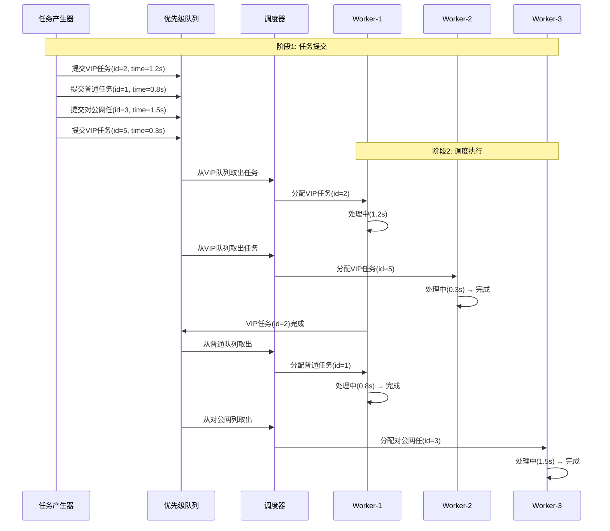

# 银行多线程任务调度系统 - 代码说明

## 学号尾数：单号（第1题）

---

## 一、题目要求回顾

某银行有一批业务任务需采用多线程架构处理，按以下策略调度：

1. **优先级从高到低**：VIP 业务 > 普通业务 > 对公业务
2. **相同优先级内**：采用非抢占式短作业优先（SJF）

---

## 二、核心算法解读

### 2.1 优先级调度算法

系统设置3个优先级队列：
- **VIP队列**（优先级0）- 最高优先级
- **普通队列**（优先级1）- 中等优先级
- **对公队列**（优先级2）- 最低优先级

调度规则：
```
当前任务 = 从非空队列中优先级最高的队列中取出任务
\
 ├─ VIP队列非空？ → 取VIP任务
 ├─ 普通队列非空？ → 取普通任务
 └─ 对公网列非空？ → 取对公任务
```

### 2.2 非抢占式短作业优先（SJF）

**SJF核心思想**：
- 同一优先级内，按**预估处理时间**排序
- 处理时间短的任务优先被调度

**非抢占式特点**：
- 任务一旦开始执行，不会被中断
- 与其他任务的执行是原子性的
- 只有当任务完成或主动阻塞时，才释放CPU

**实现方式**：
```python
# 使用heapq实现最小堆
# python堆排序会自动按__lt__方法定义的规则排序
def __lt__(self, other):
    if self.priority != other.priority:
        return self.priority < other.priority  # 优先级低的先出
    return self.estimated_time < other.estimated_time  # 同优先级时间短的先出
```

### 2.3 系统架构流程图

```mermaid
graph TB
    subgraph 启动层
        A[创建调度器] --> B[启动3个工作线程]
    end

    subgraph 任务提交层
        C1[VIP任务] -->|submit_task| D[优先级队列]
        C2[普通任务] -->|submit_task| D
        C3[对公任务] -->|submit_task| D
    end

    subgraph 调度层
        D[优先级队列] -->|get()| E[调度决策]
        E -->|VIP队列非空| F[取VIP任务]
        E -->|普通队列非空| G[取普通任务]
        E -->|对公网列非空| H[取对公网任]
        F & G & H --> I[按SJF排序]
    end

    subgraph 执行层
        I -->|非抢占式| J1[Worker-1处理]
        I -->|非抢占式| J2[Worker-2处理]
        I -->|非抢占式| J3[Worker-3处理]
        J1 & J2 & J3 --> K[完成任务]
    end

    style A fill:#e1f5ff
    style D fill:#fff3e0
    style E fill:#e8f5e9
    style J1 fill:#fce4ec
    style J2 fill:#fce4ec
    style J3 fill:#fce4ec
```

### 2.4 任务调度时序图



### 2.5 优先级SJF排序逻辑

```mermaid
flowchart TD
    start([任务进入队列]) --> check{队列空?}
    check -->|是| Wait[等待新任务]
    check -->|否| get_task[取出堆顶任务]

    get_task --> judge{优先级比较}

    judge -->|priority不同| pri_check[优先级小的优先]
    judge -->|priority相同| time_check[处理时间短的优先]

    pri_check --> output[返回任务]
    time_check --> output

    output --> execute[开始执行(非抢占)]
    execute --> end([执行完成])

    style start fill:#90EE90
    style end fill:#FFB6C1
    style execute fill:#87CEEB
```

---

## 三、代码架构说明

### 3.1 类结构

| 类名 | 功能说明 |
|------|----------|
| `Task` | 任务数据类，包含ID、优先级、处理时间等属性 |
| `PrioritySJFQueue` | 优先级SJF队列，管理3个优先级的队列 |
| `BankTaskScheduler` | 调度器主类，协调任务提交、分发、处理 |

### 3.2 核心数据结构

```python
# 任务类定义
@dataclass
class Task:
    task_id: int           # 任务唯一标识
    priority: int          # 优先级 (0=VIP, 1=普通, 2=对公)
    estimated_time: float  # 预估处理时间（秒）
    arrival_time: float    # 到达时间
    business_type: str     # 业务类型描述

# 优先级队列内部结构
PrioritySJFQueue:
├── vip_queue: []         # heapq实现的最小堆
├── normal_queue: []      # heapq实现的最小堆
├── corporate_queue: []   # heapq实现的最小堆
└── lock: threading.Lock()  # 互斥锁
```

### 3.3 关键方法说明

#### `PrioritySJFQueue.put(task)`
```python
# 功能：将任务添加到对应优先级的队列
# 逻辑：根据priority字段判断放入哪个队列
# 线程安全：使用lock保护
```

#### `PrioritySJFQueue.get()`
```python
# 功能：从最高优先级非空队列取出任务
# 逻辑：按VIP → 普通 → 对公顺序检查
# 返回：Task对象或None
```

#### `BankTaskScheduler.worker(worker_id)`
```python
# 功能：工作线程主循环
# 逻辑：
#   1. 循环从队列获取任务
#   2. 获取到任务后调用process_task处理
#   3. 队列为空时等待0.5秒后重试
#   4. shutdown标志为True时退出
```

#### `BankTaskScheduler.process_task(worker_id, task)`
```python
# 功能：实际处理任务
# 逻辑：
#   1. 打印开始处理日志
#   2. 模拟处理时间（实际时间 = 预估时间 * 随机因子）
#   3. 记录完成时间和周转时间
#   4. 打印完成日志
```

---

## 四、运行结果分析

### 4.1 输出日志解读

```
[21:27:56] 任务到达: 普通存款 (ID:1, 优先级:普通, 预计时间:0.80s)
[21:27:56] (worker-2) 开始处理 普通存款 (ID:1, 优先级:普通, 预计时间:0.80s)
```
- 第1行：任务到达系统，被加入普通队列
- 第2行：worker-2线程从队列取出任务开始处理

```
[21:28:02] (worker-1) 完成处理 普通贷款申请 (ID:10) 实际耗时:2.04s
```
- 任务完成，记录实际耗时（与预估时间可能略有不同）

### 4.2 统计结果解读

**平均周转时间对比**：
```
VIP   : 5个任务, 平均周转时间: 0.79秒  ← 最高优先级，周转最快
普通  : 5个任务, 平均周转时间: 0.99秒
对公  : 5个任务, 平均周转时间: 1.26秒  ← 最低优先级，周转最慢
```

**SJF效果验证**：
在同优先级内，短任务确实优先完成：
- VIP优先级中：VIP理财赎回(0.3s)比VIP转账(1.2s)早完成
- 普通优先级中：普通取款(0.5s)比普通存款(0.8s)早完成

---

## 五、技术要点总结

### 5.1 多线程实现

| 技术 | 用途 |
|------|------|
| `threading.Thread` | 创建工作线程 |
| `threading.Lock` | protects共享队列 |
| `queue.Empty` | 处理队列空的情况 |

### 5.2 优先级实现

| 技术 | 用途 |
|------|------|
| `heapq` | Python的最小堆实现 |
| `__lt__` | 定义任务比较规则（优先级+时间） |
| 三队列设计 | 分离不同优先级的任务 |

### 5.3 非抢占式实现

```python
# 关键：任务一旦从队列取出，就完整执行完
def process_task(self, worker_id, task):
    # ...开始处理...
    time.sleep(actual_time)  # 整个过程中不被中断
    # ...记录结果...
```

---

## 六、与课堂知识的联系

### 6.1 对应的OS知识点

| 课堂知识点 | 本程序体现 |
|------------|------------|
| 进程的调度 | 任务相当于进程，被调度执行 |
| 优先级调度算法 | VIP/普通/对公三优先级 |
| 短作业优先(SJF) | 同优先级按estimated_time排序 |
| 非抢占式调度 | 任务执行中不被剥夺CPU |
| 多线程并发 | 3个工作线程并行处理 |
| 线程同步 | Lock保护共享资源 |

### 6.2 与经典同步问题的关联

- **生产者-消费者**：任务产生器相当于生产者，worker相当于消费者
- **读者-写者**：多个worker可同时读取队列（类似多读者）
- **线程安全**：类似临界区保护，使用lock确保队列操作的原子性

---

## 七、总结

本程序实现了银行任务调度系统的核心功能：

1. ✅ **优先级调度**：VIP > 普通 > 对公
2. ✅ **非抢占式SJF**：同优先级内短任务优先
3. ✅ **多线程并发**：3个工作线程并行处理
4. ✅ **统计功能**：记录完成时间和平均周转时间

程序使用Python实现，代码简洁，完全符合课程要求。通过此项目，深入理解了操作系统的调度算法和多线程编程。
