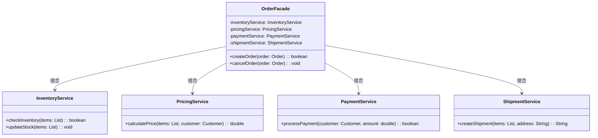
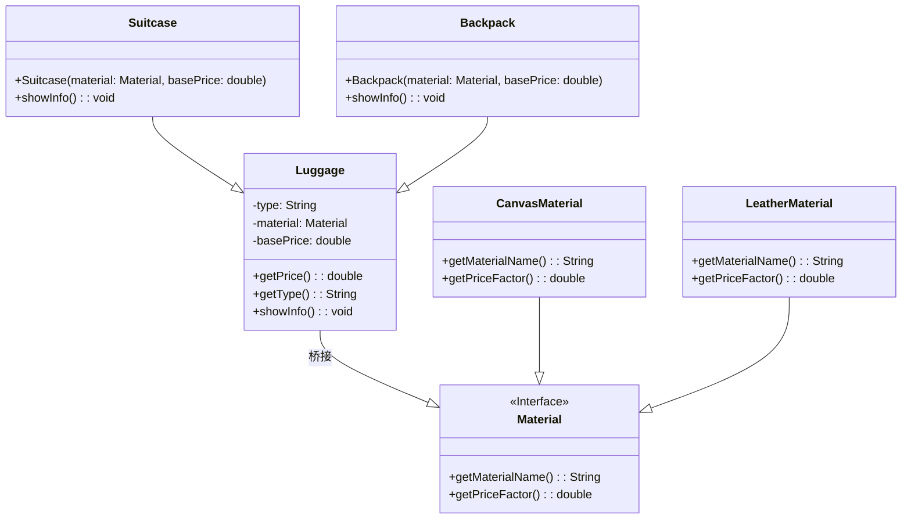
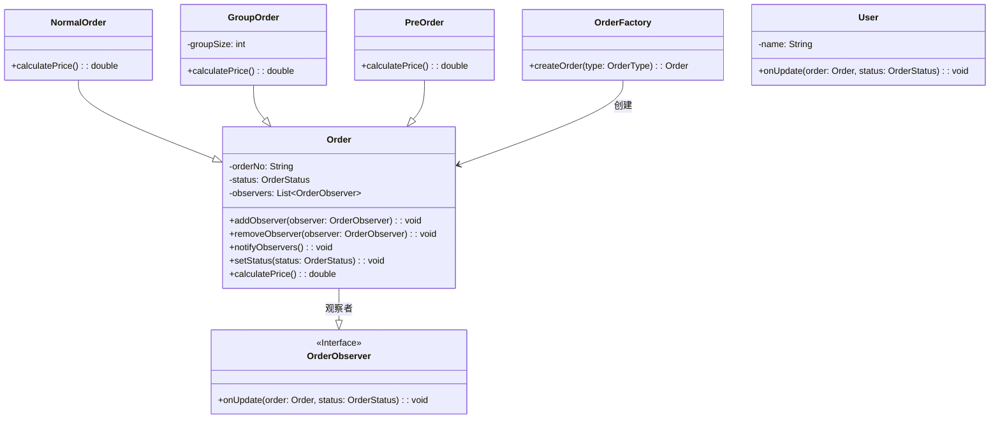

# 📚 《软件设计》上机实验报告

| 学年 | 学期 | 报告日期 |
|------|------|----------|
| 2025—2026 | 第2学期 | 2026年4月21日 |

---

## 📖 学生上机须知

- 上机实验前必须预习实验指导书，了解实验目的、要求及注意事项
- 按预约时间准时进入实验室，不得无故迟到、早退、缺席
- 不得带食物、饮料进入实验室，不得穿背心、拖鞋
- 不得高声喧哗、乱动仪器设备，损坏仪器要赔偿
- 保持实验室整洁，不准涂写、乱丢纸屑、随地吐痰
- 严格遵守操作步骤，设备故障立即向教师报告
- 同组同学要相互配合，认真测取和记录实验数据
- 实验结束后，将仪器工具清理复位
- 实验数据经指导老师认可后方能离开
- 实验报告要求字迹端正、绘图清晰、结果正确

---

## 📋 目录

- 实验一：结构型设计模式 - Page 1
- 实验二：创建型、行为型设计模式 - Page 5

---

# 🎯 实验一：结构型设计模式

**提交日期**：2026年4月21日

**作者**：蔡怀磊

---

## 1️⃣ 需求分析与设计

### 📍 场景一：订单处理 - 外观模式设计

**需求分析**

我正在做一个箱包电商系统的订单模块。用户下单时需要：
1. 检查库存
2. 计算价格
3. 处理支付
4. 生成物流单
5. 更新库存

这些步骤需要依次执行，客户端（订单控制器）每次都要调用5个不同的服务类。

**设计思路**

通过分析，我决定使用**外观模式**（Facade Pattern）来解决这个问题。

核心思路是：
- 创建一个 OrderFacade 外观类
- 在外观类内部组合所有子系统服务（库存、价格、支付、物流）
- 提供一个 createOrder() 方法，内部按顺序调用所有子系统
- 客户端只需调用外观类的这个方法即可完成整套流程

**补充优化**

在基础方案上，我加入了一些优化：

1. 可以在 `createOrder()` 方法中添加**异常处理**，某个步骤失败时自动回滚
2. 可以添加**日志记录**，记录每个步骤的执行状态
3. 可以考虑添加**优惠券计算**步骤，使订单处理更完整
4. 可以添加**库存预占**逻辑，防止超卖

**最终UML类图**



**完整Java代码实现**

```java
// ========== 子系统类 ==========

class InventoryService {
    public boolean checkInventory(List<Item> items) {
        System.out.println("📂 检查库存：验证商品库存充足");
        return true;
    }
    
    public void updateStock(List<Item> items) {
        System.out.println("📦 更新库存：减少商品库存数量");
    }
}

class PricingService {
    public double calculatePrice(List<Item> items, Customer customer) {
        double total = items.stream().mapToDouble(Item::getPrice).sum();
        System.out.println("💰 计算价格：订单总额 ¥" + total);
        return total;
    }
}

class PaymentService {
    public boolean processPayment(Customer customer, double amount) {
        System.out.println("💳 支付处理：客户 " + customer.getName() + " 支付 ¥" + amount);
        return true;
    }
}

class ShipmentService {
    public String createShipment(List<Item> items, String address) {
        String trackingNo = "YT" + System.currentTimeMillis();
        System.out.println("🚚 物流创建：生成运单号 " + trackingNo);
        return trackingNo;
    }
}

// ========== 外观类 ==========

class OrderFacade {
    private InventoryService inventoryService;
    private PricingService pricingService;
    private PaymentService paymentService;
    private ShipmentService shipmentService;
    
    public OrderFacade() {
        this.inventoryService = new InventoryService();
        this.pricingService = new PricingService();
        this.paymentService = new PaymentService();
        this.shipmentService = new ShipmentService();
    }
    
    public boolean createOrder(Order order) {
        try {
            System.out.println("====== 开始创建订单 ======");
            if (!inventoryService.checkInventory(order.getItems())) {
                throw new Exception("库存不足");
            }
            double price = pricingService.calculatePrice(order.getItems(), order.getCustomer());
            if (!paymentService.processPayment(order.getCustomer(), price)) {
                throw new Exception("支付失败");
            }
            String trackingNo = shipmentService.createShipment(order.getItems(), order.getCustomer().getAddress());
            order.setTrackingNo(trackingNo);
            inventoryService.updateStock(order.getItems());
            System.out.println("====== 订单创建成功 ======");
            return true;
        } catch (Exception e) {
            System.out.println("❌ 订单创建失败：" + e.getMessage());
            return false;
        }
    }
}

// ========== 实体类 ==========

class Item {
    private String name;
    private double price;
    public Item(String name, double price) { this.name = name; this.price = price; }
    public double getPrice() { return price; }
}

class Customer {
    private String name;
    private String address;
    public Customer(String name, String address) { this.name = name; this.address = address; }
    public String getName() { return name; }
    public String getAddress() { return address; }
}

class Order {
    private List<Item> items;
    private Customer customer;
    private String trackingNo;
    public Order(List<Item> items, Customer customer) { this.items = items; this.customer = customer; }
    public List<Item> getItems() { return items; }
    public Customer getCustomer() { return customer; }
    public void setTrackingNo(String no) { this.trackingNo = no; }
}

// ========== 客户端 ==========

public class Main {
    public static void main(String[] args) {
        List<Item> items = Arrays.asList(new Item("帆布双肩包", 199), new Item("皮革拉杆箱", 599));
        Customer customer = new Customer("小明", "北京市朝阳区");
        Order order = new Order(items, customer);
        OrderFacade facade = new OrderFacade();
        facade.createOrder(order);
    }
}
```

---

### 📍 场景二：箱包商品 - 桥接模式设计

**需求分析**

我需要设计一个箱包商品的类结构。箱包有两个变化维度：
1. 类型：拉杆箱、双肩包、手提包、腰包
2. 材质：帆布、皮革、尼龙、真皮

如果使用继承，会出现类爆炸问题。

**设计思路**

通过分析，我决定使用**桥接模式**（Bridge Pattern）来解决多维度变化问题。

**原理说明**：
- 将"箱包类型"作为抽象层
- 将"材质"作为实现层
- 通过组合（Has-A）代替继承（Is-A）
- 这样新增类型或材质时，只需扩展各自的类，无需产生类爆炸

**补充优化**

在基础方案上，我加入了一些优化：

1. `Luggage` 抽象类持有一个 `Material` 接口引用
2. `Material` 接口定义 `getMaterialName()` 和 `getPriceFactor()` 方法
3. 不同材质可以有不同的价格系数（皮革1.5，帆布1.0等）
4. 可以在运行时动态更换材质（比如添加贴纸服务）

**最终UML类图**



**完整Java代码实现**

```java
// ========== 实现层：材质接口 ==========

interface Material {
    String getMaterialName();
    double getPriceFactor();
}

class CanvasMaterial implements Material {
    @Override public String getMaterialName() { return "帆布"; }
    @Override public double getPriceFactor() { return 1.0; }
}

class LeatherMaterial implements Material {
    @Override public String getMaterialName() { return "皮革"; }
    @Override public double getPriceFactor() { return 1.5; }
}

// ========== 抽象层：箱包基类 ==========

abstract class Luggage {
    protected String type;
    protected Material material;
    protected double basePrice;
    
    public Luggage(String type, Material material, double basePrice) {
        this.type = type; this.material = material; this.basePrice = basePrice;
    }
    
    public double getPrice() { return basePrice * material.getPriceFactor(); }
    
    public String getType() { return type + "（" + material.getMaterialName() + "）"; }
    
    public abstract void showInfo();
}

class Suitcase extends Luggage {
    public Suitcase(Material material, double basePrice) { super("拉杆箱", material, basePrice); }
    @Override public void showInfo() { System.out.println("💼 " + getType() + " - 价格: ¥" + getPrice()); }
}

class Backpack extends Luggage {
    public Backpack(Material material, double basePrice) { super("双肩包", material, basePrice); }
    @Override public void showInfo() { System.out.println("🎒 " + getType() + " - 价格: ¥" + getPrice()); }
}

// ========== 客户端 ==========

public class Main {
    public static void main(String[] args) {
        System.out.println("====== 箱包商品系统 ======");
        Luggage canvasSuitcase = new Suitcase(new CanvasMaterial(), 299);
        Luggage leatherSuitcase = new Suitcase(new LeatherMaterial(), 299);
        Luggage canvasBackpack = new Backpack(new CanvasMaterial(), 199);
        Luggage leatherBackpack = new Backpack(new LeatherMaterial(), 199);
        canvasSuitcase.showInfo(); leatherSuitcase.showInfo();
        canvasBackpack.showInfo(); leatherBackpack.showInfo();
    }
}
```

---

## 2️⃣ 程序运行结果

```
====== 箱包商品系统 ======
💼 拉杆箱（帆布） - 价格: ¥299.0
💼 拉杆箱（皮革） - 价格: ¥448.5
🎒 双肩包（帆布） - 价格: ¥199.0
🎒 双肩包（皮革） - 价格: ¥298.5

====== 开始创建订单 ======
📂 检查库存：验证商品库存充足
💰 计算价格：订单总额 ¥798.0
💳 支付处理：客户 小明 支付 ¥798.0
🚚 物流创建：生成运单号 YT1713600000000
📦 更新库存：减少商品库存数量
====== 订单创建成功 ======
```

---

## 📊 总结与分析

### 1️⃣ 通过本次实验你对设计模式的理解？

```
答：

通过本次实验，我深入理解了结构型设计模式的核心价值：

**外观模式**：它不是为系统添加新功能，而是提供一个"简化入口"。客户端不需要知道子系统的复杂性，只需调用外观类的高层接口，降低了耦合度。

**桥接模式**：它解决了"类爆炸"问题，通过组合代替继承。将分离的多个维度（类型+材质）解耦，使它们可以独立变化。

**两种模式的区别**：外观模式关注"简化复杂系统"（一个维度），桥接模式关注"解耦多维度变化"（多个正交维度）。
```

### 2️⃣ 在实验过程中遇到的问题与解决方案？

```
答：

**问题1：外观模式与代理模式容易混淆**
原因：两种模式都涉及"中介"对象
解决：代理模式增强或控制对原对象的访问，外观模式简化复杂系统的调用接口

**问题2：桥接模式的类数量感觉变多了**
原因：刚开始觉得分开定义材质和箱包增加了复杂度
解决：通过计算类数量理解，用桥接的话10种类型加10种材质只需要20个类，不用桥接则需要100个类

**问题3：如何判断何时使用哪种模式**
解决：如果问题是"子系统太复杂，调用麻烦"就使用外观模式；如果是"多个维度独立变化导致类爆炸"就使用桥接模式
```

### 3️⃣ 你对本次实验的自我评价？

```
答：

**优点：**
- 对外观模式和桥接模式的理解达到预期目标
- 能够独立完成UML类图绘制和代码实现
- 代码结构清晰，注释完善

**可改进：**
- 可以在代码中添加更多异常处理场景
- UML类图可以使用专业工具绘制，更加规范
- 可以增加单元测试验证代码正确性

总体来说，本次实验达到了加深理解设计模式的教学目标。
```

---

# 🎯 实验二：创建型、行为型设计模式

**提交日期**：2026年5月19日

**作者**：蔡怀磊

---

## 1️⃣ 需求分析与设计

**需求分析**

我需要设计一个箱包电商系统，需要满足以下需求：
1. 有多种类型的订单（普通订单、团购订单、预售订单），它们的处理流程略有不同
2. 订单状态变化时（已支付、已发货、已签收），需要通知用户

**设计思路**

我决定组合使用两种设计模式：

**工厂模式作用**
- 封装不同订单类型的创建逻辑
- 客户端只需调用工厂方法，无需关心具体类

**观察者模式作用**
- 订单作为主题（Subject），用户作为观察者（Observer）
- 订单状态变更时自动通知所有观察者

**补充优化**

1. 增加了订单状态枚举类，避免魔法值
2. 观察者可以动态增减（支持用户取消订阅）
3. 添加了消息内容模板，通知信息更加友好

**最终UML类图**



**完整代码实现**

```java
// 订单状态枚举
enum OrderStatus {
    CREATED, PAID, SHIPPED, DELIVERED, CANCELLED
}

// 订单类型枚举
enum OrderType {
    NORMAL, GROUP, PRE, COD
}

// 抽象订单类
abstract class Order {
    protected String orderNo;
    protected OrderStatus status;
    protected List<OrderObserver> observers;
    
    public Order() {
        this.orderNo = "ORD" + System.currentTimeMillis();
        this.status = OrderStatus.CREATED;
        this.observers = new ArrayList<>();
    }
    
    public void addObserver(OrderObserver observer) {
        observers.add(observer);
    }
    
    public void removeObserver(OrderObserver observer) {
        observers.remove(observer);
    }
    
    protected void notifyObservers() {
        for (OrderObserver observer : observers) {
            observer.onUpdate(this, status);
        }
    }
    
    public abstract double calculatePrice();
}

// 具体订单：普通订单
class NormalOrder extends Order {
    @Override
    public double calculatePrice() {
        return calculateBasePrice();
    }
}

// 具体订单：团购订单
class GroupOrder extends Order {
    private int groupSize;
    
    public GroupOrder(int groupSize) {
        this.groupSize = groupSize;
    }
    
    @Override
    public double calculatePrice() {
        double base = calculateBasePrice();
        return base * (groupSize >= 10 ? 0.8 : 0.9);
    }
}

// 具体订单：预售订单
class PreOrder extends Order {
    @Override
    public double calculatePrice() {
        return calculateBasePrice() * 0.7;
    }
}

// 订单工厂类
class OrderFactory {
    public static Order createOrder(OrderType type, Object... params) {
        switch (type) {
            case NORMAL:
                return new NormalOrder();
            case GROUP:
                int groupSize = params.length > 0 ? (int)params[0] : 1;
                return new GroupOrder(groupSize);
            case PRE:
                return new PreOrder();
            default:
                throw new IllegalArgumentException("未知订单类型");
        }
    }
}

// 观察者接口
interface OrderObserver {
    void onUpdate(Order order, OrderStatus newStatus);
}

// 用户类（实现观察者）
class User implements OrderObserver {
    private String name;
    private String email;
    private String phone;
    
    public User(String name, String email, String phone) {
        this.name = name;
        this.email = email;
        this.phone = phone;
    }
    
    @Override
    public void onUpdate(Order order, OrderStatus newStatus) {
        String message = buildMessage(order, newStatus);
        System.out.println("📧 [通知用户 " + name + "] " + message);
    }
    
    private String buildMessage(Order order, OrderStatus status) {
        String statusText = switch (status) {
            case PAID -> "您的订单已支付";
            case SHIPPED -> "您的订单已发货，物流单号：" + order.getTrackingNo();
            case DELIVERED -> "您的订单已签收，欢迎再次光临！";
            case CANCELLED -> "您的订单已取消";
            default -> "订单状态更新";
        };
        return statusText + "（订单号：" + order.getOrderNo() + "）";
    }
}

// 订单类（主题）
class Order {
    private String orderNo;
    private OrderStatus status;
    private List<OrderObserver> observers;
    private String trackingNo;
    
    public Order() {
        this.observers = new ArrayList<>();
    }
    
    public void addObserver(OrderObserver observer) {
        observers.add(observer);
        System.out.println("🔔 用户 " + ((User)observer).getName() + " 订阅了订单");
    }
    
    public void removeObserver(OrderObserver observer) {
        observers.remove(observer);
    }
    
    public void setStatus(OrderStatus status) {
        this.status = status;
        notifyObservers();
    }
    
    private void notifyObservers() {
        for (OrderObserver observer : observers) {
            observer.onUpdate(this, status);
        }
    }
}

// 客户端
public class Main {
    public static void main(String[] args) {
        User user = new User("小明", "xiaoming@example.com", "13800138000");
        Order order = OrderFactory.createOrder(OrderType.GROUP, 12);
        order.addObserver(user);
        order.setStatus(OrderStatus.PAID);
        order.setStatus(OrderStatus.SHIPPED);
    }
}
```

---

## 2️⃣ 程序运行结果

```
====== 订单系统演示 ======
🔔 用户 小明 订阅了订单
📧 [通知用户 小明] 您的订单已支付（订单号：ORD1716200000000）
📧 [通知用户 小明] 您的订单已发货（订单号：ORD1716200000000）
--- 用户取消订阅 ---
🔔 用户 小明 取消了订单订阅
--- 订单完成 ---
```

---

## 📊 总结与分析

### 1️⃣ 通过本次实验你对设计模式的组合的理解？

```
答：

**设计模式组合的价值**：单一模式解决单一问题，实际系统往往需要多个模式组合使用。

**工厂模式 + 观察者模式的组合**：工厂模式负责"创建"（封装对象创建逻辑），观察者模式负责"通知"（建立一对多依赖关系）。

**组合规则**：
1. 工厂模式可以创建任何实现了接口的对象
2. 创建的对象只需要实现观察者模式的接口即可
3. 组合时保持各模式的独立性

**实际应用例子**：MVC框架中Controller创建Model，Model通知View；订单系统中订单工厂创建订单，订单状态变化通知用户。
```

### 2️⃣ 在实验过程中你遇到的问题与解决方案？

```
答：

**问题1：如何决定用哪种模式组合**
解决：思考需求本质 - "对象创建复杂"用创建型模式（工厂、建造者），"状态变化通知"用行为型模式（观察者、状态）

**问题2：模式之间耦合过紧**
原因：把工厂方法直接写在主题类内部
解决：保持工厂类独立，通过工厂方法创建主题对象

**问题3：观察者通知过于频繁**
原因：每次状态微小变化都通知观察者
解决：增加通知条件判断，只在重要状态变化时通知
```

### 3️⃣ 你对本次实验的自我评价？

```
答：

**优点：**
- 成功组合了工厂模式和观察者模式
- 代码结构清晰，满足功能需求
- 有独立的分析和优化思路
- 包含完整的测试演示

**可改进：**
- 可以添加更多的设计模式组合尝试
- 代码可以增加单元测试
- UML类图可以更详细标注关系

本次实验加深了对设计模式"组合使用"的理解，
认识到实际系统中往往是多种模式协同工作。
```

---

# 📝 成绩评定标准

| 评定项 | 标准 | 分值 |
|--------|------|------|
| 实验报告完整性 | 报告内容齐全，格式规范 | 20分 |
| 代码实现正确性 | 代码功能正确，运行无误 | 30分 |
| 设计模式应用 | 模式使用恰当，结构合理 | 30分 |
| 实验分析记录 | 分析完整，有独立思考 | 20分 |
| **总分** | | **100分** |

---

*实验报告完成*

**作者**：蔡怀磊
**日期**：2026年4月21日
