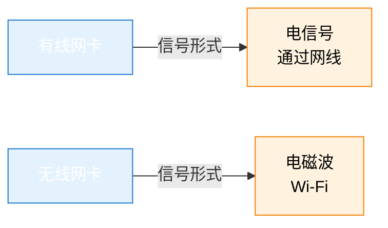
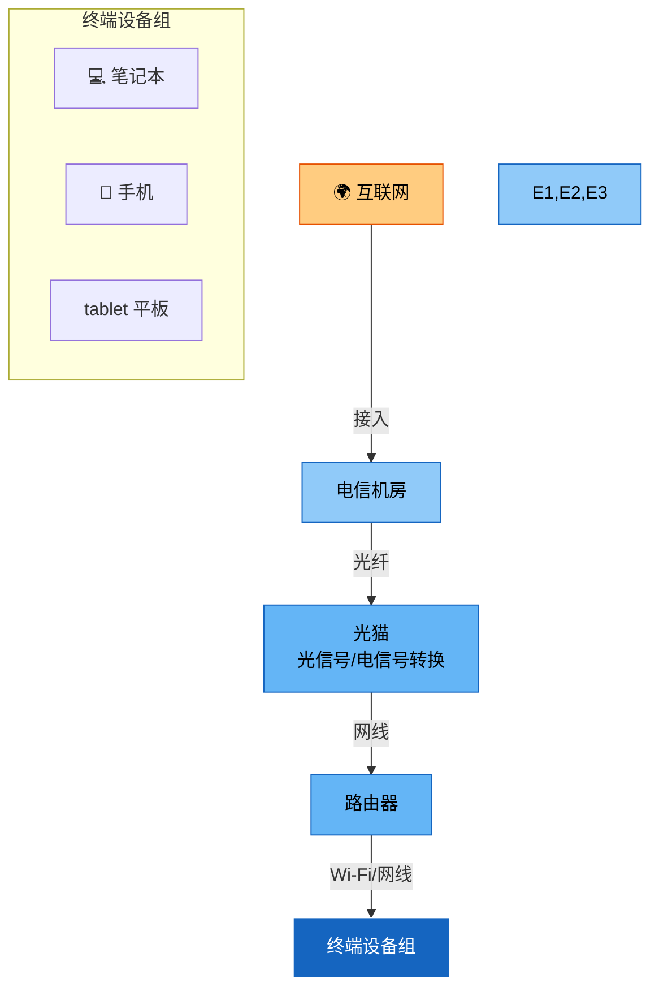
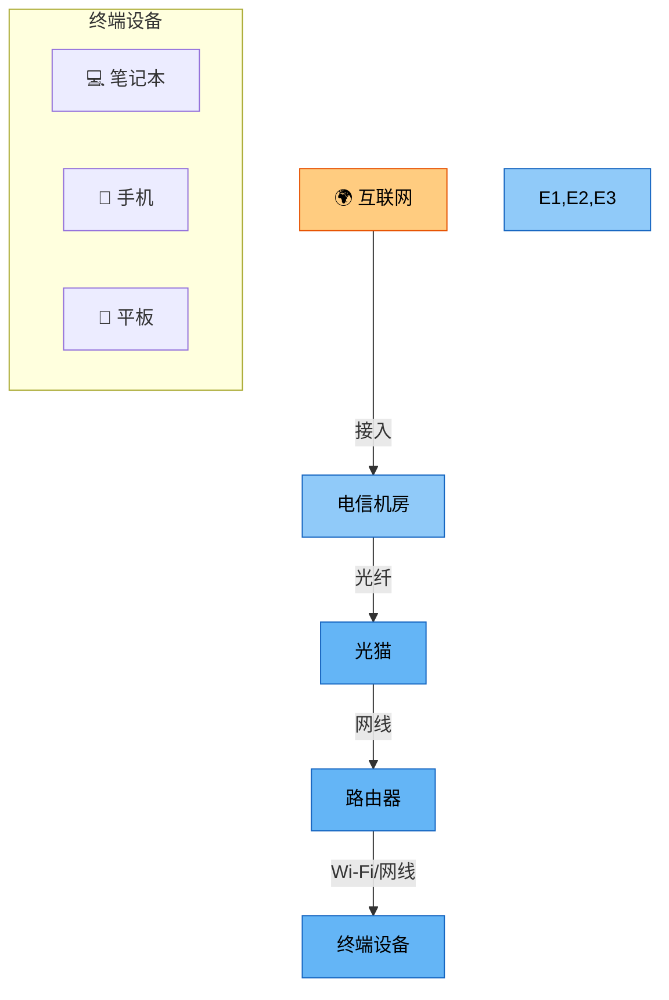
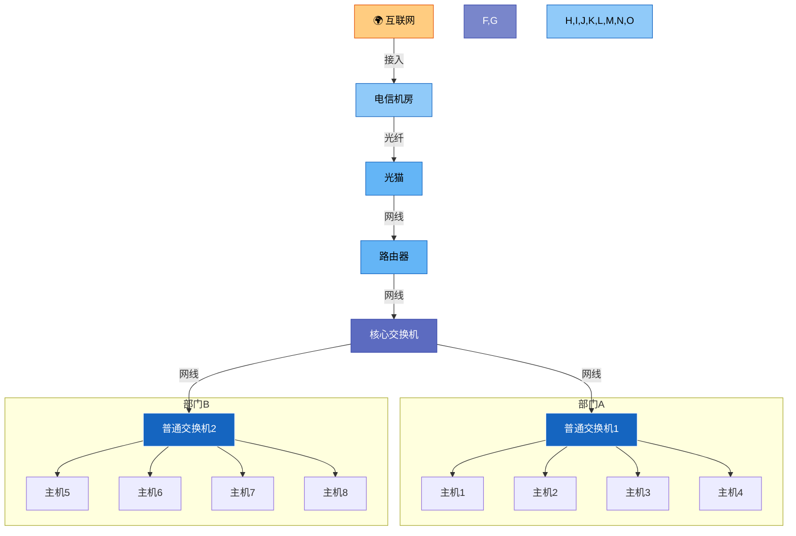
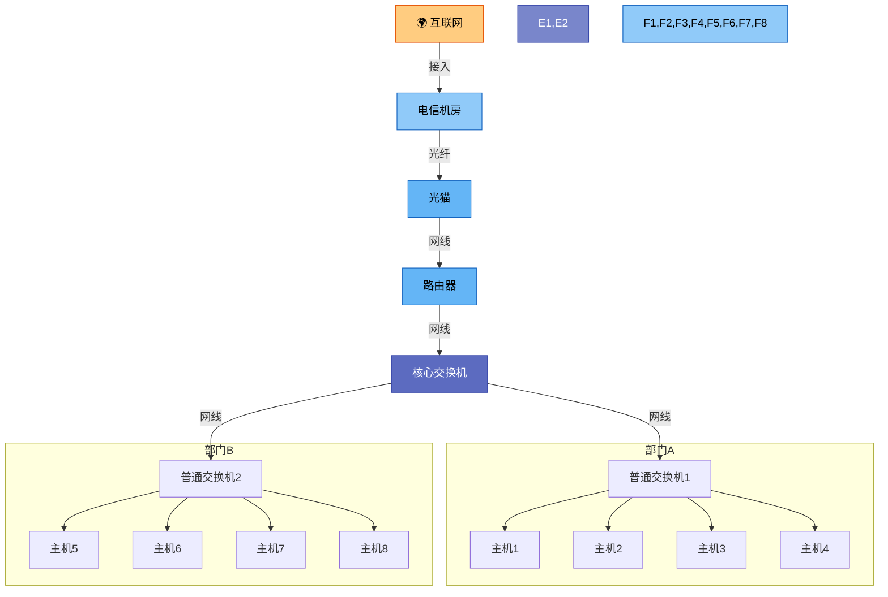
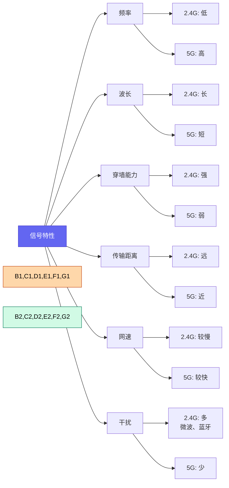

# 第一课：上午 - 网络基础与设备

> **授课老师**：赵老师
> **日期**：2026-03-14（星期五）上午
> **课程内容**：网络重要性、网卡、家庭/企业网络拓扑、Wi-Fi技术

---

## 📚 为什么要学网络？

**网络是安全的基础载体**

> "如果你不掌握网络，攻击从哪里来？攻击必然要通过数据包来传递。"
>
> "数据包可以通过抓包工具（如Wireshark）来截取、解析和分析。"

**结论**：**没有网络就没有网络安全**。学习网络安全必须掌握网络基础。

**赵老师的例子**：
> "我们的生活中很多设备都接入了互联网——结婚了！[笑]
> 我的手机、电脑，还有智能家居、车联网，都是已经接入到网络里面了。"

---

## 🖥️ 网卡介绍

### 网卡的作用

网卡是计算机与网络之间的接口，负责**电信号与网络信号的转换**：

```
网络信号 ↔ 网卡（转换） ↔ 电信号（电脑识别）
```

### 有线网卡 vs 无线网卡



| 类型       | 信号形式       | 特点         |
| -------- | ---------- | ---------- |
| **有线网卡** | 电信号（通过网线）  | 固定位置，信号稳定  |
| **无线网卡** | 电磁波（Wi-Fi） | 灵活移动，受环境影响 |

**笔记本电脑**通常同时具备两种网卡。
**台式机**原生仅支持有线网卡，如需Wi-Fi需额外购买无线网卡（如USB接收器）。

**赵老师的例子**：
> "我这个信号接收器是MSI是微星的。把它接到你的主板后面，然后它就像一个小鲨鱼鳍一样，你可以放到你的电脑上边。"

---

## 🏠 家庭网络拓扑结构



**脑图结构**（可参考上图理解）：



**设备功能说明**：

| 设备 | 主要功能 | 注意事项 |
|------|---------|---------|
| **光猫** | 光信号/电信号转换 | 不具备路由转发功能，信号发射能力弱，通常位于入户处 |
| **路由器** | 路由转发、无线信号发射、DHCP分配IP、防火墙 | 必备设备，信号比光猫强，可连接多台设备 |

**推荐配置**：光猫 + 路由器组合使用。光猫负责信号转换，路由器负责网络管理和无线覆盖。

**赵老师的例子**：
> "router厂商有什么比较出名的TP-Link，然后什么华为？思科等等，这些都是非常出名的设备。三聪明的这个厂商大家肯定都有听过。我自己的路由器就是华为的这华为的他的网络还是比较厉害的对，网络设备"

---

## 🏢 企业网络拓扑结构



**脑图结构**（可参考上图理解）：



**故障影响范围说明**：
- **普通交换机故障** → 仅影响本部门设备
- **核心交换机故障** → 影响所有连接设备

| 设备 | 功能 | 故障影响范围 |
|------|------|------------|
| **普通交换机** | 连接部门内多台设备 | 局部（本部门） |
| **核心交换机** | 汇总各普通交换机流量 | 全局（大面积） |

**设计原因**：
- 路由器接口数量有限
- 交换机接口数量多（几十个）
- 防止普通交换机占用路由器接口

**赵老师的例子**：
> "你如果公司规模特别大，然后你路由器接口它是有限的对吧？即使它是企业级的路由器，他接口都是有限的那接口有限怎么办？那最后肯定是会用光的。对不对？那那用光了，那不就插不过来吗，对不对？"

**赵老师的讲解**：
> "如果说这个普通交换机它坏了，它就可能影响的就是只是这一片区域的这设备，对不对？这是影响到这一个区域的设备。但如果你是核心交换机坏了，那它影响的就是说所有跟它接入到所有接入到它的设备上面来的所有的区域，影响是一大块一大块的"

---

## 📶 Wi-Fi技术

### 2.4G vs 5G信号对比



| 特性 | 2.4G | 5G | 说明 |
|------|------|----|------|
| **频率** | 低 | 高 | 2.4G赫兹 vs 5.0G赫兹 |
| **波长** | 长 | 短 | 波长越长穿墙能力越强 |
| **穿墙能力** | 强 | 弱 | 2.4G更适合跨墙通信 |
| **传输距离** | 远 | 近 | 5G距离较短需更多AP |
| **网速** | 较慢 | 较快 | 5G理论速度更高 |
| **干扰** | 较多（微波、蓝牙） | 较少 | 2.4G设备多易冲突 |

**选择建议**：
- **公司/大面积覆盖**：使用2.4G（穿墙强，覆盖范围大）
- **家庭/小面积**：使用5G（速度快，干扰少）

**赵老师的例子**：
> "2.4G赫兹，还有一个多少？5.0G赫兹。那5.0的肯定要比2.4要更D来吗？"
>
> "比如说你这栋教学楼它是不同的交换机，他用的不同的交换机，那它的这个网站也是不一样的。机房的话它它应该有独立的独立的路由器、网关、交换机这些东西。毕竟你要保证你要保证这个你要保证生产环境。机房对机房的话要保证生产环境，网络肯定是要畅通的。"

### 网线规格

- **标准**：568B
- **线序**：4根线上传，4根线下载
- **类型**：双绞线（减少电磁干扰）

---

## 📶 Wi-Fi技术

### 2.4G vs 5G信号对比

| 特性 | 2.4G | 5G | 说明 |
|------|------|----|------|
| **频率** | 低 | 高 | 2.4G赫兹 vs 5.0G赫兹 |
| **波长** | 长 | 短 | 波长越长穿墙能力越强 |
| **穿墙能力** | 强 | 弱 | 2.4G更适合跨墙通信 |
| **传输距离** | 远 | 近 | 5G距离较短需更多AP |
| **网速** | 较慢 | 较快 | 5G理论速度更高 |
| **干扰** | 较多（微波、蓝牙） | 较少 | 2.4G设备多易冲突 |

---

## ⚠️ 注意事项

### 介质匹配问题

**问题场景**：设备只有有线网卡，无法连接Wi-Fi。

**解决方案**：根据设备类型选择合适的网络接入方式。

**现状**：现代电脑和手机普遍自带无线网卡，介质匹配不再是问题。

**赵老师的例子**：
> "比如说你这台设备，你wi-fi它发送的是这个无线的信号，对吧？它发送的是无线信号。但是你这台机器他只有有线的网卡，他只有线网卡，那他是不是没办法去接你的，那他是不是没办法去接你的连接这个wi-fi，对不对？他只能够插网线。这个就要考虑介质问题了。"

---

## 📚 本节课重点总结

| 主题 | 要点 |
|-----|------|
| **网络重要性** | 网络是安全的基础载体，没有网络就没有网络安全 |
| **网卡** | 有线（电信号）vs 无线（电磁波），笔记本通常两者兼具 |
| **光猫** | 光信号/电信号转换，不具备路由功能 |
| **路由器** | 家庭上网必备，信号发射能力强于光猫 |
| **交换机** | 企业网络必备，连接多台设备，接口数量多 |
| **核心交换机** | 大公司使用，汇聚各普通交换机流量，故障影响范围大 |
| **Wi-Fi** | 2.4G穿墙强但速度慢，5G速度快但穿墙弱，按需选择 |

---

## 🎯 赵老师的课堂练习（课后思考）

### 练习1：主机如何判断目标是否在同一网段？

**题目**：主机1要和主机2通信，当数据包发送到交换机时，交换机会如何处理？

**解题步骤**：

主机在发送数据前需要判断目标是否在同一网段，因为交换机只认识MAC地址，不认识IP地址：

```
1. 主机计算自己的网络地址：
   用自己的IP地址 AND 子网掩码 = 自己的网络地址

2. 主机计算目标网络地址：
   用目标IP地址 AND 子网掩码 = 目标网络地址

3. 比较两个网络地址：

   - 如果相同（在同一网段）
     → 主机发送ARP请求获取目标主机的MAC地址
     → 通过交换机直接发送数据帧（使用MAC地址）

   - 如果不同（不在同一网段）
     → 主机发送ARP请求获取网关（路由器）的MAC地址
     → 将数据帧发送给网关，由网关进行路由转发
```

**赵老师的原话**：
> "比如说你从一号要跟发通信，我一这个东西发送过来到这个交换机上面这个IP地址，他知道自己的IP等于多少。他就就会发广播，那他会先看什么呢？因为一要发送给他，他会先看一这个原IP地址，它是不是这个段，是不是5.22.34这个段。如果是的话，它才会发广播。"

**答题要点**：
- **交换机**工作在数据链路层，通过MAC地址转发数据帧，不处理IP地址
- **主机**需要判断目标IP是否在同一网段，决定是直接通信还是发送给网关
- 如果不在同一网段，数据包会发送给默认网关（路由器）

---

### 练习2：广播域划分

**题目**：为什么需要划分广播域？如何划分广播域？

**解题思路**：

```
问题：当网络中有10台机器时，如果都连在同一个交换机上，
      每台机器发送广播包，会产生多少个广播包？

答案：n台机器，每台都发送广播 → 约 n² 个广播包
     10台机器 → 约 100 个广播包 → 网络拥堵
```

**赵老师的原话**：
> "划分广播域，其实就是什么呢？其实就是我在这里划分广播域。我刚才这些。我只是这些5台6台7台、8台对吧？本来我也是连接在这里的对吧？但现在我连接到这边来。"

**划分方法**：

```
使用路由器配合IP地址段划分广播域：

广播域1：192.168.1.0/24  (1-254台主机)
         ↓
      [交换机1]
         ↓
      [路由器]
         ↓
      [交换机2]
广播域2：192.168.2.0/24  (1-254台主机)
```

**答题要点**：
- 广播风暴：多设备广播导致网络拥堵
- 划分方法：使用路由器配合IP地址段划分
- 路由器不会转发广播包，有效隔离广播域

---

> **整理完成时间**: 2026-04-04
> **整理人**: Claude
