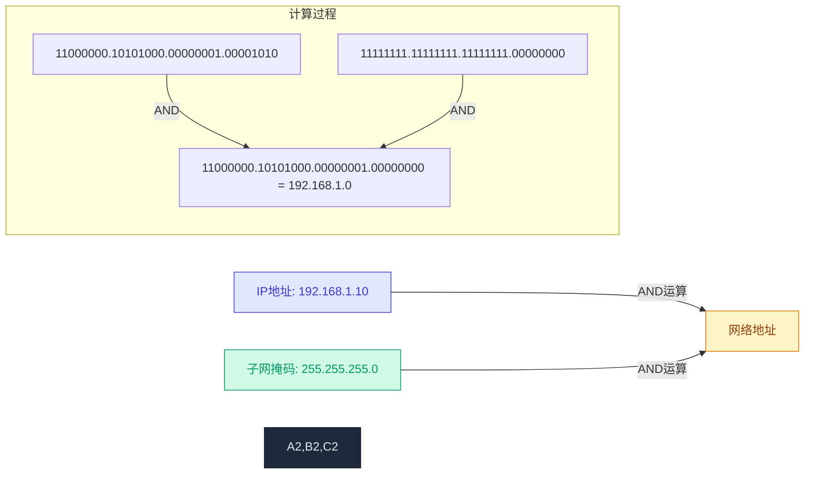
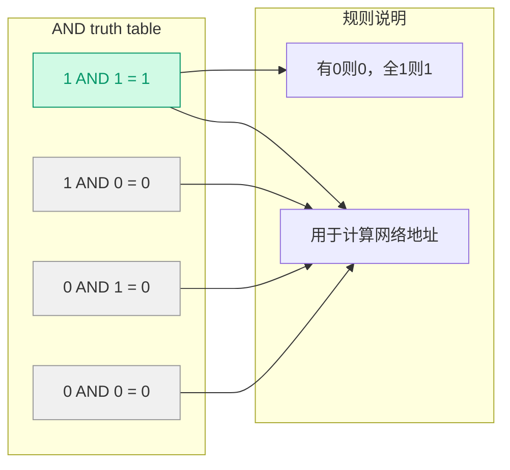
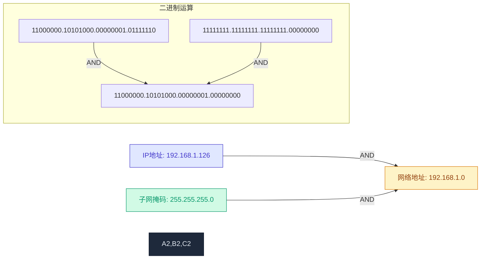
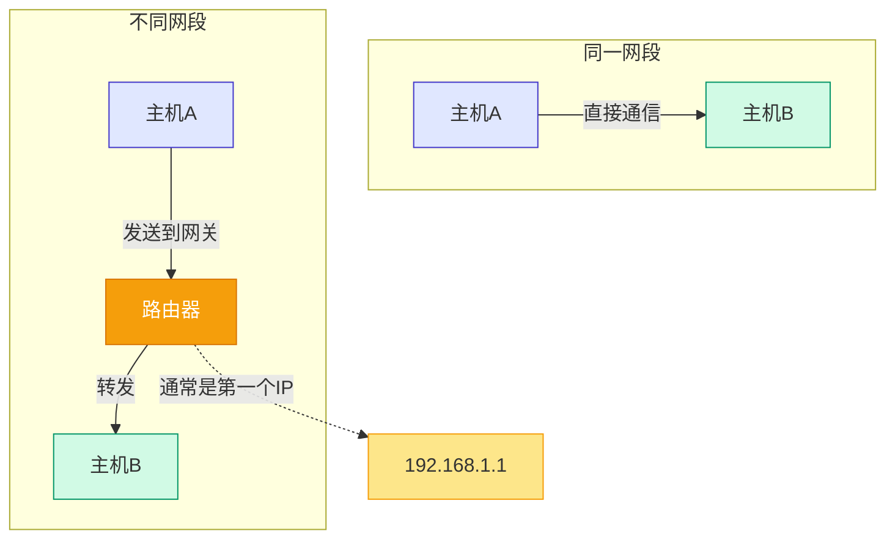
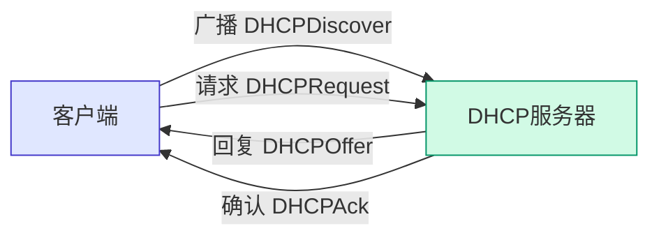
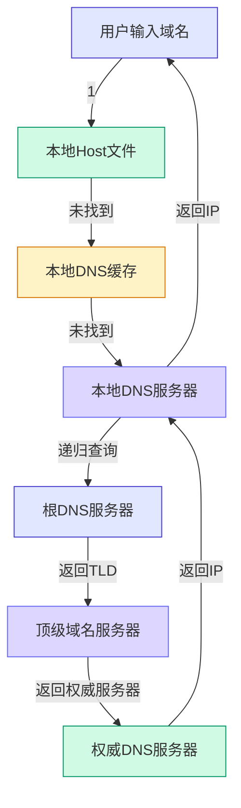
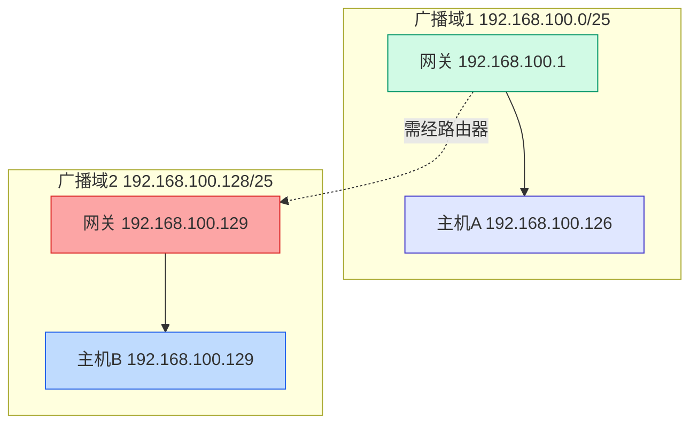
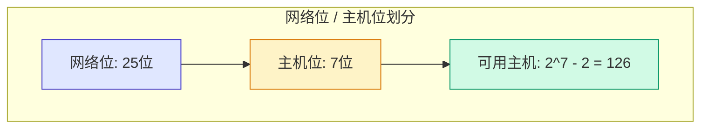

# 第二课：子网掩码与DHCP

> **授课老师**：赵老师
> **日期**：2026-03-21（星期三）
> **课程内容**：子网掩码、与运算、DHCP动态地址分配、默认网关、DNS域名解析

---

## 📏 子网掩码详解

### 子网掩码的作用



**子网掩码**：用于分割IP地址中的**网络位**和**主机位**


| 表示法 | 子网掩码 | 说明 |
|--------|----------|------|
| /24 | 255.255.255.0 | 前24位为网络位，后8位为主机位 |
| /25 | 255.255.255.128 | 前25位为网络位，后7位为主机位 |
| /16 | 255.255.0.0 | 前16位为网络位，后16位为主机位 |

**记忆方法**：斜杠后的数字表示网络位的二进制1的个数。

### 网段大小比较

| CIDR | 可用IP数量 | 网段大小 | 说明 |
|------|-----------|---------|------|
| /24 | 254个 | 较小 | 2^8 - 2 = 254 |
| /16 | 65534个 | 较大 | 2^16 - 2 = 65534 |

**赵老师的小练习**：
> "大家想一下 /16 和 /24 ，我们就拿这三个数字来举例。这三个数字哪一个网段大一点？
> 把你答案打在这个评论区，哪一个网段它代表的网段大一点？"

**赵老师的解答**：
> "非常好啊，有两个同学已经回答出来了，/16 比 /24 大，为什么呢？
> 让我们来分析一下：
>
> /16 表示：255.255.0.0，前16位是网络位，后16位是主机位
>    - 主机位可以变化的范围：0.0 到 255.255
>    - 可用IP数量：2^16 - 2 = 65534 个
>
> /24 表示：255.255.255.0，前24位是网络位，后8位是主机位
>    - 主机位可以变化的范围：0 到 255
>    - 可用IP数量：2^8 - 2 = 254 个
>
> 结论：/16 的网段更大，因为它的主机位更多，可以容纳的IP地址更多。
> 记忆口诀：数字越小，网段越大。"

---

## 🧮 与运算详解

### 与运算规则



| A | B | A AND B |
|---|---|---------|
| 1 | 1 |    1    |
| 1 | 0 |    0    |
| 0 | 1 |    0    |
| 0 | 0 |    0    |

**规则**：两个位都是1，结果才为1；否则为0。

**记忆口诀**：有0则0，全1则1

### 计算网络地址



### 计算网络地址

**运算说明**：**运算说明**：
- 对应位都是1时，结果为1
- 只要有一位是0，结果为0
- 子网掩码中1的部分保留IP地址，0的部分清零
- 结果就是该IP地址所在的网络地址

---

## 📏 子网掩码详解

| 地址 | 名称 | 说明 |
|------|------|------|
| X.X.X.0 | 网络地址 | 代表整个网段，不能分配给主机 |
| X.X.X.255 | 广播地址 | 用于广播通信，不能分配给主机 |

**赵老师的讲解**：
> "那么问题来，你256个地址你全都能用吗？显然不是都可以用的，不是的。
> 我们还是拿这个举例，172.16.10.0这个地址，还有这个172.16.10.255，
> 这两个地址它是不可以用的，这两个地址叫保留地址，这是我们的保留地址保留地址。"

**赵老师的讲解**：
> "然后这个 10.0 是什么东西呢？这个 10.0 它是网络号，这个东西它是网络号，
> 网络号是网络号。通过这个网络号就可以找到对应网络号，就可以找到这个网络号对应的网段了。
> 网络号，然后这个 255 它是广播地址，广播地址，这个是广播地址，我们可以我们等一下会说的，
> 等一下会说。"

**可用IP计算公式**：
```
2^主机位数 - 2
```
减2的原因：减去网络地址和广播地址。

**赵老师的讲解**：
> "所以说他也不是 256 ，也不是 255 ，实际上它是 254 。实际可用的地址是 256 减去 2 等于 254 个，对吧？ "

---

## 📌 默认网关

### 网关的作用



**默认网关**：连接不同网段的设备（通常是路由器）

**通信流程**：
1. 同一网段内通信：直接发送到目标设备
2. 不同网段通信：发送到网关（路由器），由路由器转发

```
同一网段：
主机A → 交换机 → 主机B（直接通信）

不同网段：
主机A → 交换机 → 路由器 → 交换机 → 主机B（需要网关）
```

### 网关地址分配

通常将网段的第一个可用IP地址分配给网关：

```
网络地址：  192.168.1.0
可用IP范围：192.168.1.1 - 192.168.1.254
网关地址：  192.168.1.1
```

**赵老师的讲解**：
> "这个是咱们网关 IP 网关 IP 其实也就是路由器的 I.P 他一般会把第一个他会把因为我的这个，
> 你看我这个 IP 地址是 3.7 ，对不对？ 3.7 那我一般都不是我就是电脑，它一般都会把第一个，
> 就把这个主机位，它的第一个，也就是说 192.168 点 3.1 ，它会把这个地址分配给路由器。

---

## 📡 DHCP动态地址分配

### DHCP的工作原理



**DHCP（Dynamic Host Configuration Protocol）**：动态主机配置协议

**作用**：自动分配IP地址、子网掩码、网关、DNS等网络配置

**分配流程**：
1. **发现阶段**：客户端广播DHCPDiscover请求
2. **提供阶段**：DHCP服务器回复DHCPOffer提供IP
3. **请求阶段**：客户端发送DHCPRequest请求使用该IP
4. **确认阶段**：服务器发送DHCPAck确认分配

### IP地址租期

| 情况 | IP地址是否会变化 |
|-----|-----------------|
| 短时间重启 | 通常不变（租期未过） |
| 长时间未使用 | 可能变化（租期过期） |

**租期作用**：防止IP地址被长期占用，提高地址利用率。

**赵老师的例子**：
> "比如说这个，下面来。这边是连电脑，这是你的电脑，然后。比如说他给你分配的这个 IP 比如你这个 IP 地址，它是 192.16 8.2 点 X2 减 X 然后它是 0 到 255 ，在 0 到 25 对吧？它是这些主机的范围， 0.25OK 那比如说我给他分配一个什么呢？我给他分配一个二，我前面的 192168 我就不打了，节省一下，都知道什么意思就可以了吗。比如说我这里给他分配一个 2.5 对吧？然后我这台笔记本我给他分配一个 2.7OK"

**赵老师的讲解**：
> "但是我们是有时候会发现我们开机，我们开机之后，我现在查一下 IP 我发现我现在是 192.168.2.5 ，我发现我现在是 2.5 。但是你有时候开机关机一下，你重启一下，它可能变成什么 2.9 了，它可能就变成 2.9 了，它是会变化的。是会变化的。但如果你说但如果说你是经常去用的，你经常的使用这个 IP ，经常使用这个 IP ，那么他是不会听他不他在 DHCP 也不会一直给你这个一直给你换个屁，那也不会，为什么？因为 IP 地址它也是有租期的，租期对吧？租期 IP 地址它是有租期的。比如说比如说这个 2.5 你可以用到什么时候？可用的可用到什么？半年、一年、一个月，它是有租期的。那么。如果你就只是说几天不用，或者是一天不用，几小时不用，关机关一下电脑再开始一般都是不会有变的，会变的。但如果你时间隔的久一点的话，时间隔得久，那它的这个周期过期了，它可能会变化的。可能会变化，又给你分配一个新的 IP 。"

---

## 🌐 DNS域名解析协议

### DNS的作用

**DNS（Domain Name System）**：域名解析系统

**功能**：将域名（如www.baidu.com）解析为IP地址。

### DNS解析流程



### DNS解析流程说明

| 步骤 | 查询位置 | 特点 | 响应时间 |
|------|---------|------|---------|
| 1 | 本地 Host 文件 | 用户手动配置，优先级最高 | 几乎为0 |
| 2 | 本地 DNS 缓存 | 系统缓存，避免重复查询 | 很快 |
| 3 | 本地 DNS 服务器 | ISP 提供，递归查询 | 较快 |
| 4 | 根 DNS 服务器 | 全球13组，返回TLD地址 | 较慢 |
| 5 | 顶级域名服务器 | 如.com、.org | 中等 |
| 6 | 权威 DNS 服务器 | 域名所有者维护 | 中等 |

### Host文件

**路径**：
- Windows：`C:\Windows\System32\drivers\etc\hosts`
- Linux/Mac：`/etc/hosts`

**作用**：手动指定域名与IP的映射关系，优先级最高。

**示例**：
```
127.0.0.1       localhost
192.168.1.100   www.example.com
```

---

## 🔍 判断是否在同一网段的方法

### 判断步骤

1. 将IP地址和子网掩码转换为二进制
2. 对两个IP地址分别进行"与运算"
3. 比较网络地址：
   - 相同：在同一网段，可直接通信
   - 不同：不同网段，需要通过路由器通信

**赵老师的小练习**：
> "OK, 我们来做一个小练习，做个小练习，给他几分钟做一下。我们都知道同一个网段的 IP 地址，
> 用物理线路联通就可以互相通信，对不对？那么不同网段的 IP 地址，即使物理线路连通了，
> 也是不可以接通信的这都可以理解，也不可以直接通信。它需要一个路由器，对吧？
> 它需要一个路由器，需要一个路由器才能互相的通信。那我们来看一下，比如说这个。
> 参考下图的子网划分示意图，我们来检验一下两台主机是否能互相通信。比如说 192.168.10 0.126 。OK, 大家来做一下，
> 这两台主机能不能互相通信？"

参考下图的子网划分示意图：



**跨网段通信流程**：
1. 主机A发现目标IP不在同一网段
2. 主机A将数据包发送给默认网关（路由器）
3. 路由器查找路由表，找到目标网段的出接口
4. 路由器将数据包转发到目标网段
5. 目标主机B接收数据包

**注意**：IP地址 192.168.100.126 和 192.168.100.129 虽然相邻，但由于子网掩码是/25（255.255.255.128），它们被划分到了不同的子网中，必须通过路由器才能通信。

**赵老师的解答**：
> "OK 公布答案，它是不可以的，这两台主机它是不能互相通信的。我看这个写出来，
> 有同学马上就说能，但实际上是不能的，知道吗？其实他不能，他又不 24 。你二四的话那个可以吗？
> 后面的不管他，但你现在是 25 了，有多了一个一吗？这里是不是多了一个一 OK ，我们来画，
> 我们来写一下，写一下就看明白了。"

```
子网掩码：255.255.255.128 (/25)

IP地址1: 192.168.100.126
二进制:   11000000.10101000.01100100.01111110
与运算:   11000000.10101000.01100100.01111110
         AND
         11111111.11111111.11111111.10000000
         -----------------------------------
结果:     11000000.10101000.01100100.01111110 = 192.168.100.126

IP地址2: 192.168.100.129
二进制:   11000000.10101000.01100100.10000001
与运算:   11000000.10101000.01100100.10000001
         AND
         11111111.11111111.11111111.10000000
         -----------------------------------
结果:     11000000.10101000.01100100.10000000 = 192.168.100.128

结论：网络地址不同（126 vs 128），不在同一网段，无法直接通信。
```

**赵老师的总结**：
> "0 和 128 ，不对，算出来。但是你算出来是这个，你 128 怎么 .算。出来的？
> 00 就按我这么写，按我这么写进行逻辑与运算。 OK0 和 1 不同网络不能通信。
> 夜班。说错了，这里应该是一，这应该是一一才是一。按一下。
> 128 怎么会一个网站是 100.0 ，一个是网站是 1128 ，他们都不一样了，
> 刚讲错了。它 25 网段，它杠 25 ，它实际上就是把一个 C 类的网络，
> 把一个 C 类的网段它切成两个子网。那 0 到 128 ，我刚才看刚才想错了，
> 这里一那才是一，你看是 128 ，那么 0 和 128 怎么 .划分呢？
> 它的它的这个区域，它的这个子网的区域就是 0 到 127 ，这个的话，那是不是就是 128 到 25 ，
> 对吧？他这个是他这个范围范围，他这个网站它的范围是 128 到 25 ，但是这个的范围是 0 到 127 。
> 明亮液体，这 2 个 IP 刚好跨过去，他刚好跨过去了。小于等于一二七是一个，大于等于 128 是另一个。
> 然后这 2 个 IP 刚好就卡在中间这条线了，卡在中间条线。"

**参考下图**：



---

## 📊 本节课重点总结

| 主题 | 要点 |
|-----|------|
| **子网掩码** | 划分网络位和主机位，像一把尺子 |
| **与运算** | 1 AND 1 = 1, 1 AND 0 = 0，用于计算网络地址 |
| **可用IP计算** | 2^主机位数 - 2（减去网络和广播地址） |
| **CIDR写法** | /24、/25等表示法，数字表示网络位的二进制1的个数 |
| **默认网关** | 通常是第一个IP（.1），路由器的IP地址 |
| **DHCP** | 动态主机配置协议，自动分配IP，有租期限制 |
| **DNS** | 域名解析服务，将域名转换为IP地址 |
| **Host文件** | 本地域名映射文件，优先级最高 |

---

> **整理完成时间**: 2026-04-04
> **整理人**: Claude
