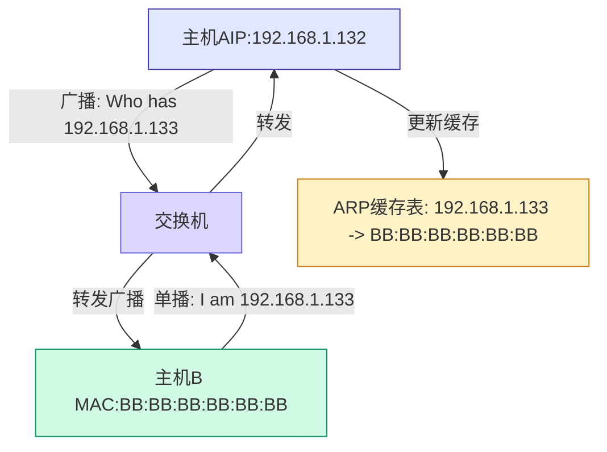
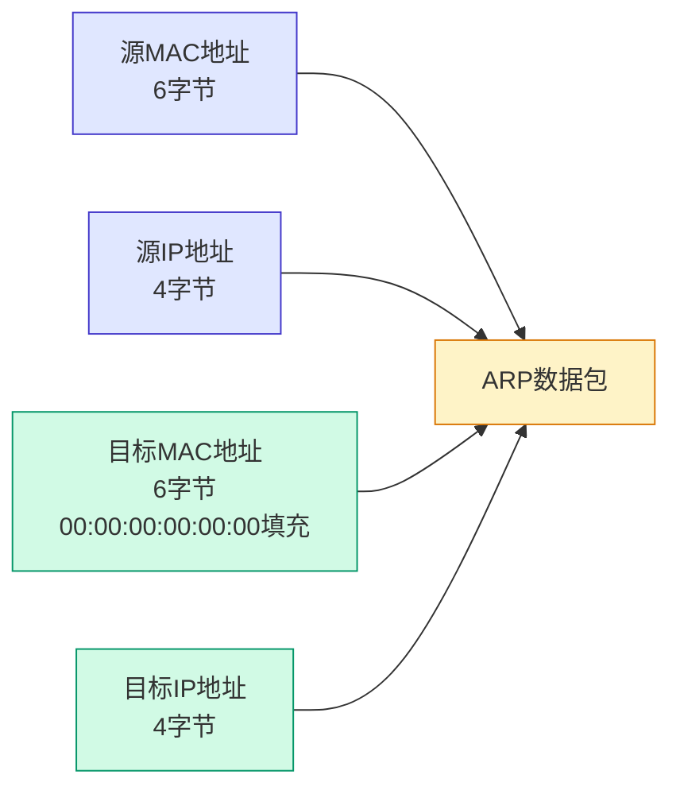
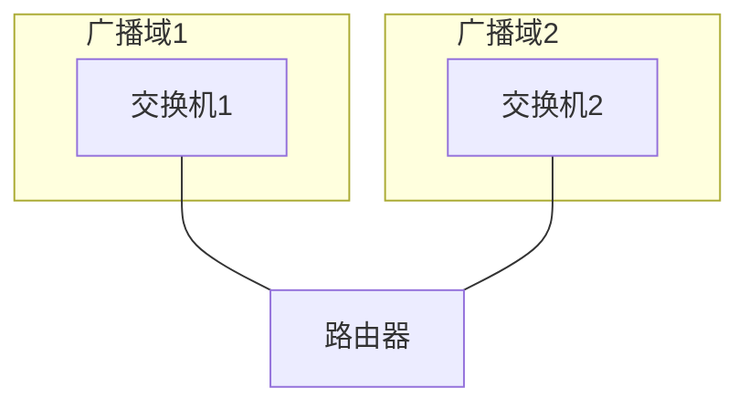

# 第三课：上午 - ARP协议与文字编码

> **授课老师**：赵老师
> **日期**：2026-03-28（星期六）上午
> **课程内容**：文字编码基础、ARP协议详解、ARP缓存表、ARP欺骗、广播风暴

---

## 📝 文字编码基础

### 计算机的二进制本质

计算机底层只识别**0和1**，代表**电压的高低**：
- 0：低电压
- 1：高电压

**赵老师的讲解**：
> "核心的原因就是他计算机他只认识0101。"
>
> "计算机底层的硬件里面，比如说CPU有内存，CPU内存他只认识0101，它是指识别底层的硬件。
> 只能识别0101，然后这个0101代表什么呢？0101它就代表着电信号的高低，电信号。电压的高低。
>
> "以前它的硬件只能识别电线和电压的高低，那无非翻译出来就两个东西，电压高电压低，
> 那么零就代表低电压。低电压一就是代表高电压。"

### ASCII编码

| 特点 | 说明 |
|------|------|
| **发明者** | 美国人 |
| **字符集** | 英文字母、数字、符号 |
| **编码长度** | 1字节（8位） |
| **表示范围** | 2^8 = 256种字符 |
| **示例** | 'A' = 01000001 |

**赵老师的讲解**：
> "这个ASCI码它最开始是美国人发明的。美国人发明的这就规定什么？那规定英文字母，
> 英文字母是用一个字节的，巴菲特也就是八位的定制。"
>
> "比如说字母A它就是用一个八位的二进制来表示。包括一些不仅是这个字母，还有一些符号数字
> 都是用这个二进制来表示。"

### ASCII的弊端

- 无法表示汉字
- 无法表示亚洲语言（日文、韩文）
- 无法表示特殊符号

### 中文编码

| 编码 | 特点 | 说明 |
|------|------|------|
| **GB2312** | 1980年发布 | 基本汉字6763个，2字节表示 |
| **GBK** | GB2312升级版 | 汉字增至21003个，包含特殊字符 |

**赵老师的讲解**：
> "GB2312，这个东西它就是用来表示中文的这个字母的。对，就是中文的汉字，中文汉字。
>
> "每个数字字母，每个数字和字母都是占一个字节的，都占就这样一个自己。但是中文它就是
> 那两个字节，中国。"
>
> "那那两个字节它是多少？杨子杰，那是不是二十几次方？那是二年级是吧，二的 16 次方吗？
> 二的 16 次方对，16 10 分，那就是，五万多，六万多。5 万 66005000 多个，其实就是可以
> 基本可以涵盖中文的所有的汉字的。基本可以涵盖，我们叫做基本可以保障所有常见的汉字。"

**赵老师的讲解**：
> "后面就进行了升级，进行升级打造了这个GBK。GBK它是一个我可以理解为它是升级版的GB2312。
> 这个涵盖会非常多了，它可以涵盖两万多个。八百多个特殊字。十号，所以说就可以做到。
> 中文就基本涵盖了。基本涵盖了所有中文特殊符号、生僻字，都是可以涵盖的。"

### Unicode与UTF-8

| 编码 | 特点 | 说明 |
|------|------|------|
| **Unicode** | 万国码 | 覆盖全球所有语言，4字节固定编码 |
| **UTF-8** | 可变长编码 | 英文1字节，中文3字节，兼容ASCII |

**为什么使用UTF-8**：
- 欧美国家文字只占用1字节，节省空间
- 中文占用3字节，足够表示
- 全世界最广泛使用的编码格式

**赵老师的讲解**：
> "后来计算机它普及到各个国家，对吧？那也就是我前段我说的第三事件。
> 我们这边是比较不发达的地方，它也是经济也发展过去了。一开始最开始发展交接肯定都是欧美是吧？
> 欧洲那边那那边国家，然后慢慢的到亚洲也发展起来，所以出现了像各种各样的东西。"
>
> "所以出现了像各种各样的东西。对于我们中国就是这个激励GB2312和GBK，然后后来其他国家是也发展过去了，
> 那怎么办？他需要一个，所以说就迫切的需要一个可以解析，可以编码所有国家语言这么一个编码。"
>
> "所以他这东西就可以说基本就覆盖了，基本覆盖了所有的中文、英文、日韩，还有东南亚的文字、
> 标点符号、数字符号、音标，而且它也包含一些表情。"

**赵老师的讲解**：
> "为什么有这 UCI 干扰呢？对于那些欧美国家来说，他们自己的文字自己文字他们自己文字的编码只占用一个字节，
> 对吧？但是现在这个 unique 搞了这么一个 unique，用四个字节来表示这些文字编码，那他的一盘空间就变大多少？"
>
> "本来是一个。变成四个，所以就变大四倍。对它的容纳空间莫名其妙就增大了四倍的需求，那他这些肯定是他肯定不愿意，
> 他不愿意。"
>
> "所以说基于这个万国码推就推出了一个可变长的编码，可变长编码这个 U. T 干嘛？可变长编码的变长编码。
> 它这个是什么？怎么去表示呢？一个英文一个字节字节一个英文一个字节，一个汉字是三个字节。
> 它是这么一种编码形式，然后这个 UTF-8 它是现在全世界用的最多的这种编码形式。"

### 乱码产生的原因

**原因**：编码与解码使用的字符集不一致

**示例**：
- 文件用UTF-8保存（3字节表示一个汉字）
- 用GB2312打开（2字节表示一个汉字）
- 结果：字节长度不匹配，出现乱码

**赵老师的小练习**：
> "比如说这个东西，我在这里面打一个汉字，吴老板对吧？吴老板，然后我就把它保存下来，
> 保存之后我看这个东西。关掉重启，它是没有乱码的，对不对？没有乱码的。"
>
> "然后我现在如果我他这个东西，你们看这个左下角，看左下角，左下角是 UT1-8 的，
> 看到没有？这个 AUTF-8，AUTF-8 的编码，也就咱们刚才讲到这个万国。
> OK，那我现在要我指定他，我不用他，那咱就走了。我指定他用什么用什么 GB2312，
> 我指定他用这个 OK 指定。不用保存，我要注意，不用这编码这个东西，这是不可逆的这东西。"
>
> "我们去指定他什么东西。那什么有阿拉伯普罗蒂萨特斯拉夫，也就是俄罗斯库兰那边的斯拉夫，
> 薄黑之类的。"
>
> "为什么本来是这个，但是它变成这个了123455个字符，为什么从三个字符变成五个字符呢？
> 有没有同学能够知道为什么结合我们刚才讲的这些东西，就像我刚才讲的这些东西，为什么本来是这个，
> 但是它变成这个了123455个字符，为什么三个变成了五个？"

---

### 练习1：为什么会出现乱码？

**题目**：同一个文件，用UTF-8保存后显示正常，改为GB2312打开却出现乱码，为什么？

**题目说明**：
- 汉字"吴老板"用UTF-8保存需要3字节（"吴"=0xE5, 0x90, 0x8D）
- 用GB2312打开时，每个汉字占2字节

**解题步骤**：

```
原始数据（UTF-8保存的"吴老板"）：
"吴" = E5 90 8D  （3字节）
"老" = E8 8� 81  （3字节）
"板" = E6 9D 90  （3字节）
总共：9字节

用GB2312解析（按2字节一组）：
E5 90      → 第1个GB2312字符
8D E8      → 第2个GB2312字符
80 81      → 第3个GB2312字符
剩余：E6 9D 90 → 只有1字节（E6）能匹配，9D 90变成乱码

结果：5个字符（乱码）
```

**赵老师的解答**：
> "SGB2312。来讲一下，你比如说原本这个是 UTF-8 来表示一下。UTF-8 来表示一下。
> UTF-8 我讲了一个汉字是三个字节，也就是三个二进制，一个就是三个二进制，那三个有多少个？
> 三三得9，那就九个，对吧？比如说 0101010100100101，然后什么 11001001OK。"
>
> "那 UTF 这个 GP231，看一下 GB231，它是中文占两个字，对不对？它占两个字解答。
> 那为什么这个会变成这个？同样都是九个，那为什么这个就变成这个了呢？"
>
> "OK 看，12311 对应。对吧？但是在 UTF 干嘛？在这个 GB2312 里边两个。
> 两个，但是你看那这样也不对，对吧？两个最后剩一个，对吧？那不应该这个怎么去搞呢？
> 所以我们可以看到它中间这个它不是中文，看到没有？中间这个意思就是这两个我表示出来的东西
> 它第一个字符，这个表示第一个，然后这两个表示第二个。然后刚好到中间的时候，他没有别人
> 跟他匹配，把他这这个东西这个东西它没法匹配成一个中文，没法匹配成成中文。"
>
> "但是在这个体系里边，这个 00100101 它又刚好代表着这么一个特殊符号。看它这个东西它是占一个字节，
> 占一个字节，所以说这个就表示这个东西，这个就表示这个是欧文的标识吗？分不出来。刚才讲这个，
> 那后面的两个，那也就一一对应了这两个。可以理解，有。这个。我是这么表示的。你理解。了吗？
> 应该是好理解的，你们班同学扣个一扣一，反正三个现在是两个。那 2 个 11 对应，刚好中间这个没人
> 给他对应，那就是变成这个特殊字符 OK"

**答题要点**：
1. UTF-8用3字节表示一个汉字
2. GB2312用2字节表示一个汉字
3. 字节长度不匹配导致解析错误
4. 多余的字节被误解析为其他字符，产生乱码

---

## 📡 ARP协议详解



### ARP的作用

**ARP（Address Resolution Protocol）**：地址解析协议

**功能**：将IP地址解析为MAC地址

**工作层级**：数据链路层（OSI模型）

**赵老师的讲解**：
> "然后他是工作在哪里呢？讲这个 OSI 汽车模型里边，它的公司它是属于数据链路层的。
> 工作站。和数据链路层电路空间，这是五层模型的文件。"

### ARP的工作流程

ARP协议三次交互说明：
![[Drawing 2026-04-04 17.36.21.excalidraw]]



**赵老师的讲解**：
> "那我们现在要干嘛？我现在要去访问他，我现在这个 16。对我的一要去访问，一定我要访问他。
> 那怎么访问？回想一下我们上上节课的那个图，就是计算机的通信里面。那我们是在同一个组里边，
> 我们先发给谁？"
>
> "我们一要找 16，我们肯定要先干嘛？我肯定要是先要发起一个 ARP 广播请求，发 ARP 的广告请求，
> 发一下问题。然后交换机就去问一下，要继续问。他就问谁是这个 192168200.16 服务意识无孩子，
> 它是 who head who s 就是交换机说了谁有这个 192.168.200.16 的的 mac 地址？"
>
> "然后这个单波请求这个 ARP 单波请求交换机拿到之后。他就会发一个广播，这是单播。然后交换机拿到之后
> 他就会发起一个 ARP 的广播，向所有连接它的设备去发起一个 ARP 的广播。也就是要去获得这个地址，
> 获得一六这个 back 地址。"

### ARP数据包结构

**ARP数据包结构**：**ARP数据包结构**：

| 字段 | 说明 |
|-----|------|
| 源MAC地址 | 发送方的物理地址 (6字节) |
| 源IP地址 | 发送方的逻辑地址 (4字节) |
| 目标MAC地址 | 未知时用00:00:00:00:00:00填充 (6字节) |
| 目标IP地址 | 需要解析的目标IP (4字节) |

**说明**：因为IP地址会变化，而MAC地址是固定的，所以物理层寻址必须使用MAC地址。

### 为什么需要MAC地址？

**IP地址的局限性**：
- IP地址可能变化（DHCP动态分配）
- MAC地址是固定的， worldwide唯一

**数据链路层通信**：必须使用MAC地址进行寻址。

**赵老师的抓包演示**：
> "那么理解，然后这个 ARP 的广播它其实是可以被抓到包的，他可以被抓到包了。那我们来看一下来。
看看怎么回事儿。我就虚拟机去抓一下。领导是先打开了，我要下。"
>
> "因为我们是交换机，我们上节课我们就直接是在本机刷本机的网卡。但是你交换机的话，肯定是要去刷这张，
刷这张虚拟网卡你暂停一下，现在还没有这个数据交换。就随便打开我计算机里面两台，然后到他们都是 NAT 模式，
NAT 模式的。我就拿我的 color 和我的 windows 来看，都是 NAT 的。没问题，都是 NAT 模式的。"
>
> "来，我们先看一下他们 IP 地址，先看一下各自的 IP 地址，IP 的这个。192168200133，来再来看一下他的。
192168200132 没问题，一个是 133，这是运气的，是 133，然后卡里是 132。同一个网段，同一个子网里面的布台机器，
就相当于就现在连接的现在这个关系，现在这个关系这个的关系 OK 那我们来进行通信一下，然后再看抓一下打包。"
>
> "怎么去。要怎么去搞呢？我们就用这台机器去拼这台机器，对吧？我们用我们用这台咖喱，我们来拼一下这个运气的机器，
就拼一下这 200133。我们来看一下这个数据包怎么样的，P192.168.20 0.1。多少？200.133OK，然后我们就在这里开始抓包。"

**赵老师的抓包结果讲解**：
> "这个东西就相当于我们交换机了，相对我们的问题，我们可以看看这个东西，看到没有？
Who has? 192168200133 问号 tail，192.168.200132，咱们看这个关系非常明显的非常明显的。
非常的明显。他的协议也跟你讲了，说是 P 协议 ARP 然后。告诉你 ARP 协议之后，他这里就 who has，
看到没有？Who has 192168200133，谁有？是不是跟我刚才讲的过程一样，对不对？
Who has 19216820033。"
>
"Party mac address, 目标的 mac 地址看这也是它是每不知道的，对不对？不知道这东西。
他现在还不知道目标的 mac 地址，所以说 his 里就用 00000 来来来填充这个地址。
Senor IP address 发送者的 IP 是这 162168，然后你看目标 IP 是很容易就获得的，
目标 IP 很容易获得，但是你目标的 mac 地址，我现在还不知道不知道的话，那他就用 0000 来填充。
而且我们可以注意看啊，这个东西它是 request 的，看到没有？这是 request 什么意思？
不请求的意思，对吧？请求要求 request，这是一个 RP 的 request 包。"

---

## 🗃️ ARP缓存表

### 缓存表的作用

存储IP地址与MAC地址的对应关系，避免频繁广播请求。

### 缓存更新机制

| 系统 | 缓存更新间隔 |
|-----|-------------|
| Windows 10 | 15-45秒 |
| 其他系统 | 可能不同 |

**赵老师的讲解**：
> "为什么不是只能发一次 ARP 广播的数据包，而是每隔一段时间发一个 ARP 请求数据，为什么为什么会这样？
对，涉及到一个 ARP 的一个机制，叫做 ARP 缓存表。两个句子有 ARP 表。"
>
> "我们的正常的。过程。就是发送，然后广播之后发送给交换机，交换机进行 ARP 广播获取到之后，
他再给他发送下换个颜色，那再给他发个消息，对不对？再给他发个消息，然后为什么要隔一段时间都要去获取一下，
这个地址每隔一段时间都要去获取一下，发送这个广播。"
>
> "因为在这个电脑里边它有这么一个缓存表，就这台机器里面它有一个缓存表，有个这么一个表叫做 ARPARP 缓存。
文表里面存的什么东西？它里面就存着目标 IP 地址，目标 IP 地址和 mac 地址。就是这么一个东西，
每台机器都有啊，它不只是这台一一这台机器，它每台机器都有每一台都有目标 IP 地址，mac 地址对吧？
但是它是会变的，但是我要注意，如果我这个一一如果我这个一一我发。"

**赵老师的讲解**：
> "MAC 永久都不变，但是 IP 会变。所以说它会将这个东西它没它会在缓存，它不会把这些东西给它缓存下来，
保存下来，就叫做 ARP 缓存表。但因为这个 IP 会变，所以说它会它需要隔一段时间去发送确认，
去确认这么一个东西。为了防止它的变化，比如说你下次你这 15，那个 16 我变成 15 了怎么办？
Mac 地址我们都说它是唯一的，但是 IP 地址它是会变化的，对不对？只有这个卖的地址它是唯一永久的不变。"

**赵老师的提醒**：
> "windows的话。而这个 ARP 缓存表，windows更新缓存的时间是 win 10。Windows 十更新保存的时间是个 15 到 45 秒，
15 秒到 40 秒它更新一次，每隔 15 秒或 45 秒，有 15 秒到 45 秒之间它会更新一次。这个保存表可以看一下，
怎么去看缓存表呢？N 加 RCNBOK，我们这叫 ARP 杠 A。我们在 ARP 杠 A 就可以去看了。看到没有 ARP，
刚才我们就可以去看我们这台电脑上缓存的所有机器的的 IP 地址和他们的 mac 地址。"

### 查看和管理ARP缓存

```cmd
# 查看ARP缓存表
arp -a

# 删除ARP缓存（需要管理员权限）
arp -d *
```

---

## ⚔️ ARP欺骗

### ARP欺骗的原理

**核心**：伪造ARP应答，篡改目标主机的ARP缓存表

**攻击流程**：

```
正常通信：
主机A（1.1） ←→ 交换机 ←→ 主机B（1.16）

ARP欺骗后：
主机A（1.1） ←→ 交换机 ←→ 攻击者（1.13）
                        ↓
                      （误认为1.16是攻击者）
```

**攻击步骤**：
1. 攻击者监听网络中的ARP请求
2. 向主机A发送伪造的ARP应答
3. 声称"192.168.1.16的MAC地址是我的"
4. 主机A更新ARP缓存，将攻击者的MAC地址与目标IP关联
5. 主机A发送给1.16的数据全部被攻击者接收

### 防范ARP欺骗的方法

| 方法 | 说明 |
|-----|------|
| **绑定静态ARP** | 手动绑定网关IP与MAC地址 |
| **开启ARP防护** | 使用防火墙或安全软件的ARP防护功能 |
| **划分VLAN** | 通过VLAN隔离不同网段 |

**赵老师的讲解**：
> "关于 ARP 的还有一些东西还有一些东西有一种攻击手法叫做 ARP 的欺骗 ARP 欺骗和广播风暴。
广播风暴我们第一节课已经讲过了，第一节讲过，我们等一下就会再简单提一嘴。"
>
> "什么是 ARP 欺骗呢？核心就是伪造 ARP 欺骗核心。伪造虚假的 P 应答。伪造虚假的 P 应答。
强行篡改别人电脑里的 IP 缓存表。"
>
> "然后把这个 IP 带上，把这个 IP 绑定到那个攻击者的假的 mac 地址吗？IP 绑定攻击者 mac this 意思就是攻击者
他会冒充网关或者是冒充目标的主机，去欺骗全网的设备，欺骗循环设备。就是说某某一个 IP 的 mac 是我，
他会欺骗而欺骗就相当于说一句什么话呢？说是一个某某 IP 的 mac 是我我 MIP 的地址，就比如说某个网关，对吧？
某个网关某某 IP 的 mac 地址是我。"
>
> "然后因为大家没有什么机制去检，没有不知道怎么去校验。所以说大家都相信之后，就会把流量全部发送给攻击者了？
对吧？攻击者他说这个，那么大家相信之后，相信后流量就全部发送给攻击者。"
>
> "不。发送给甄网关了，不发送两张广告。能理解吗？也就是这么一个过程这一个过程。"

---

## 🌪️ 广播风暴

### 广播风暴的成因

当网络中设备数量过多时：
1. 每台设备都可能发送ARP广播
2. 所有广播包都会被发送到所有设备
3. 大量广播包占用带宽
4. 导致正常数据传输受阻

**问题**：广播包消耗网络资源，影响效率。

### 解决方案：划分广播域

**方法**：使用路由器配合IP地址段划分广播域



**原理**：路由器不会转发广播包，有效隔离广播域。

**赵老师的讲解**：
> "广播风暴的话就是你交换机连接主机，你交换机连接主机如果太多了，对吧？大家你看我是只是一台颜色的，
这里显示的只是一台机器吗？只是在演示。一台机器。但是如果你所有机器都发送的话，这些机器我同时发送给交换机，
大家都去做这个 ARP 广。他这个 ARP 广播一次只能一次，一次只能一个，就只服务于一个。那这么多的话，那是不是就堵塞了？
我的一二的、一三的、一四的全部堵在这里，等着上一个发送完成，它才能进行下一个。那这样的话势必就会造成这个资源的浪费，
就占用了这个资源了。而且他连接的多，他发送是不是也多？连接的都是发连的多是发的也多。一次广播就非常的耗费资源，
然后广播次数多就容易造成网络堵塞。"

**赵老师的解决方案**：
> "那解决办法就是什么呢？这方法就是划分广播域的划分，这个题我们讲过了，这已经讲过了。"
>
> "不要这样子。通过路由器配合 IP 地址段来进行广播域的划分。"
>
> "有多台。交换机。交换机。一。交换机二相机一，交换机 2，然后交换机一，它再去划分。再去大部分。的广播域。
这边就是广播域广播。那办卡。浪一浪二等等，那什么乱三乱四，这就只画出这么一点点。就这个。样子了。"

---

## 📊 本节课重点总结

| 主题 | 要点 |
|-----|------|
| **文字编码演变** | ASCII → GB2312 → GBK → Unicode → UTF-8 |
| **ARP协议** | 地址解析协议，将IP地址解析为MAC地址 |
| **ARP工作原理** | 广播请求 → 单播回复 → 获取MAC地址 |
| **ARP缓存表** | 存储IP与MAC对应关系，每15-45秒更新 |
| **ARP欺骗** | 伪造ARP应答，篡改缓存表，将流量导向攻击者 |
| **广播风暴** | 多设备广播导致网络拥堵 |
| **广播域划分** | 通过路由器配合IP地址段划分 |

---

> **整理完成时间**: 2026-04-04
> **整理人**: Claude
