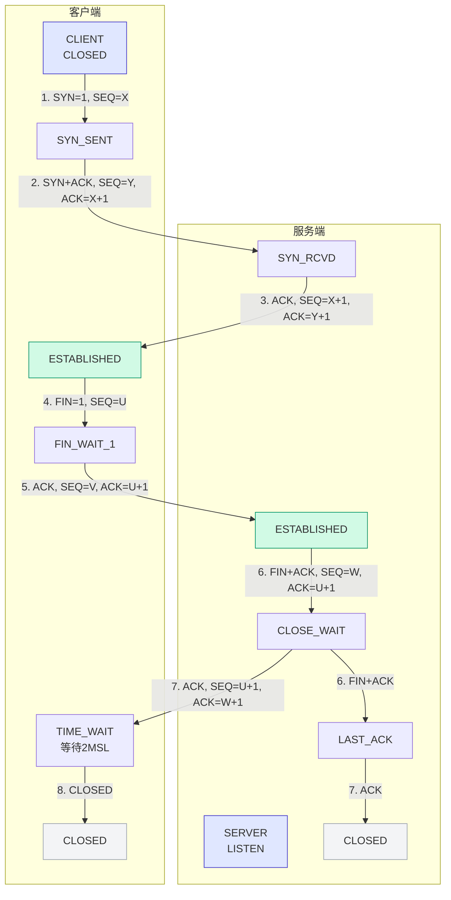

# 第三课：下午 - TCP/UDP与三次握手四次挥手

> **授课老师**：赵老师
> **日期**：2026-03-28（星期六）下午
> **课程内容**：TCP协议、UDP协议、三次握手、四次挥手、TCP/UDP区别

---

## 🆚 TCP vs UDP

### TCP特点

| 特性 | 说明 |
|------|------|
| **连接方式** | 面向连接（需要建立连接） |
| **可靠性** | 可靠传输（保证数据完整） |
| **传输方式** | 流式传输（无边界） |
| **资源消耗** | 较大（需要建立和释放连接） |
| **速度** | 较慢（需要确认和重传机制） |

**应用场景**：网页浏览、文件传输、邮件发送

### UDP特点

| 特性 | 说明 |
|------|------|
| **连接方式** | 无连接（不需要建立连接） |
| **可靠性** | 不可靠传输（不保证数据完整） |
| **传输方式** | 数据报传输（有边界） |
| **资源消耗** | 较小（无需建立连接） |
| **速度** | 较快（无确认和重传机制） |

**应用场景**：直播、视频流、DNS查询

**赵老师的例子**：
> "稳定TCP比如什么呢？难道举一些例子吗？就举一些例子。那有什么例子没有？是的，没错。"
>
> "你UDP的话，你比如说我要去直播，这都有直播。也很多同学都都提到了，直播需要快速的传输数据，
快速传输数据。你就因为它不是可靠的连接，丢掉一些。比如说你直播的话，我4K和2K你少一些像素，
像素掉了一些，模糊了一些或者卡了一些，是一点点的卡顿。其实一点点卡顿它没有什么影响，对不对？
它没有什么影响，它对是因为这样子他就省去了很多的开销，对吧？省去了很多开销，然后速度比较快。
UDP它开销小一点，开销小速度快，开销小速度快，然后。直播还有些什么？"
>
> "直播，我是视频网站。等等这些。类似的对类似的，那就通常使用的是UDP，UDP服务实时性。高的应用。"

### 应用层协议对比

| 协议 | 传输层协议 | 说明 |
|-----|-----------|------|
| HTTP/HTTPS | TCP | 网页浏览 |
| FTP | TCP | 文件传输 |
| SMTP | TCP | 邮件发送 |
| DNS | UDP | 域名查询（也可用TCP） |
| TFTP | UDP | 简单文件传输 |

**赵老师的讲解**：
> "UDP对应的。应用层协议里面有DNS。FTP、TFTP、TFTP、TFTP、SNMP、NFS等等OK。然后什么是TCP的话，它就是提供一种可靠的传输方式，
可靠传输方式。但是因为它是可靠，要建立连接，也要释放连接，所消耗的资源是比较多的。资源消耗大，速度慢，
但是可靠性可靠。OK对应的这个应用程序，应用层协议。SMTP、FTP、HTTP、TELNET这些。东西。对，
然后这些那些东西他也是定多少号了，这协议我刚才我现在提到的这些协议对应的端口号的。"

**赵老师的讲解**：
> "我们刚才提到是SMTP、HTTP、FTP这些东西。有FTP，FTP是21。21、201端口，然后这个是TCP的UDP有这么一些括号括起来。
SMB应该是SMB，不过这个不重要
SMB是Windows文件共享协议，默认端口445。SSH默认端口是22。UDP协议有这么。一些服务。这也是应用程序，后面这些都是应用程序。"

---

## 🤝 TCP三次握手（参考下图）

### 三次握手的目的

**双向确认**：确认客户端和服务端的收发能力都正常。

**避免的情况**：
- 客户端能发消息但收不到响应
- 服务端能收消息但发不出响应

### 三次握手的过程

| 握手步骤 | 报文方向 | 标志位 | 序列号 | 确认号 | 状态变化 |
|---------|---------|--------|--------|--------|---------|
| 第一次 | 客户端→服务端 | SYN=1 | X | - | SYN_SENT |
| 第二次 | 服务端→客户端 | SYN=1, ACK=1 | Y | X+1 | SYN_RCVD |
| 第三次 | 客户端→服务端 | ACK=1 | X+1 | Y+1 | ESTABLISHED |

**状态变化流程：**

客户端:  CLOSED → SYN_SENT → ESTABLISHED
         (发送SYN)   (接收SYN+ACK)

服务端:  LISTEN → SYN_RCVD → ESTABLISHED
         (接收SYN)   (发送SYN+ACK)

**赵老师的讲解**：
> "OKTCP的三次握手，我都跟我们说，我们先看这个过程，看整个过程。这是客户端在服务端就相当
于这也是CS架构的客户端client，服务端server也是CS架构的这相当于什么呢？比如说我这里是就这里
就是我，然后这里是我要去访问的，我要去访问百度这个网站，ok这是他的服务器。那么我要和他我要去查个东西，
我要去查东西，我首先要和他进行连接，对不对？首先要和它建立连接，那和它建立连接我要去怎么去建连接呢？
这整个过程还没有进行数据传输，只是在进行连接。"
>
> "三次握手的过程。咱们的实现都是要去干嘛？三次握手的核心是双向确认。什么叫商业确认呢？确认什么样的？
我们要确认的是啥？我们要确认的是啥？我们要确认的是客户端和服务端的接收的收发能力是否是正常的，
确认发送接受funk。客户端、服务端的接收发送能力是否正常？要确认那个东西。"
>
> "就是避免出现。我能发，但是我收不到你消息，你能收，但是发不出消息的情况，只有这样子才能够确定建立稳定的连接。"

**第一次握手**：
> "OK第一次握手，客户端发起请求，客户端主动向服务器端发送请求报文。核心的这个东西就是他这个税包里面包含了啥？
包含了SYN包等于1，SY8等于一，SEQ等于X就是咱们的初始序列号。就咱们的初始序列号SN等于一代表什么呢？一次washSYN等于
一代表。代表这个快捷键。代表我要发起评价，我这个客户端要对你的服务端发起连接，发起。然后我的初始序列号是SEQ的X
刚才讲了这个是随机生成的，序列号是多少我们不知道，它是它生成的时候就随机生成，比如说一千。然后他的目的是干什么呢？
目的就是告诉服务器，告诉服务器我现在要和你建立连接，我想和你建立。建立indian，我想和你建立连接。然后我的初始的序列号是X
初始序列不是X是吧？我的初始序列号是X然后你是可以开始你可以开始接收我的数据了。"
>
> "就是这个你可以开始接收我的数据了。这个是第一次模式。第一次模。对，发送过去之后，客户端同时进入了一个SY send的状态，
这是状态。看这个SYN center，这是一个状态，SYN.状态就是说同步已发送等待这个东西就是等待服务器端确认我第一次握手发送的消息。"

**第二次握手**：
> "第二次握手，第二次握手，第二次握手，那就是服务器都发送给我们了不是不是他来不是我们去发送给他服务端到客户端，
它发送一个什么呢？看SYN等于1SEQ等于YACK等于1ACK等于X加1OK那我们来回顾一下上面的每个数据包是什么意思。
ACK是回应标识的意思，SYP连接SCK回应标识，这里都有。SY等于一，ACK等于1，那是什么意思呢？就是我说第二次word是服务系统，
他想表达什么？服务器端客户，这个服务器他收到客户端的连接请求之后会回复一个确认报文。回复一个确认。抱稳确正加头部。抱稳。
意思呢？目的就是我先解释每一个的东西，SY等于一代表什么？和第一个一样，它也是看第一次我说它也有XY等于一，
所以说这个XY等于一表示我已经准备好和你建立连接了。就是服务器端他也告诉服客户端，我也准备好和你建立连接了。
然后第2个SEQ等于Y，SEQ等于Y是什么意思呢？SEQ等于Y就是初始序列号，和上面一个一样，也是随机生成的，是服务器端，是服务器的，
输入序列号去生成。比如说两千是吧？然后ACK等于1，就是表示我确认收到了你的sone请求了。我确认。收到你sone请求了，就这意思，
回忆标准要写的更具体一点，就是我确认。确认收到连接请求了，上面。就是说要和你发起连接。一个比较拟人的，否则拟人的说法只是说他
好像在说这句话一样，等于一就是OK。那ACK等于1？这个小写的ACK等于X加1。他表示我已经收到了你序列号为X的消息，我已经收到你
序列号为X的消息。第一个SEQ等于X消息ACK就是我已经收到你这个消息了，下一次请你发送X加一及以后的消息。"
>
> "然后这第二次握手是非常关键的一步。表示自己确实是收到了，表明服务端确认已经收到了来自客户端的。消息，已经收到你的消息了，对吧？
然后我还能够发消息，也。告诉。客户端我能够发消息，我发消息我的初始序列号是就这意思。然后也是在告诉他，我已经准备好进行连接了，
你也要准备好和和我建立连接。OK, 然后我们看它指示状态是这个发送过去之后，它的状态就变进入了SYNRCBD。也就是说什么这个同步已接收，
等待客户端的最终确认，等待他最终确认，对。"

**第三次握手**：
> "第三次握手。快点，第三次握手就是我客户端发给他的，客户端发给他的构成百搭的ACK等于1，SCQ等于X加1，SEQ等于X加1，ACK也等于Y加1。
这表示这是最后的确认报文最后的确认报文，那这个该讲了，确认链接，确认请求，我确认你发送给我的请求。目的就是告诉服务器，我已经收到了你的确认，
同步我这边也准备好了，这边也完全准备好。连接可以正式建立。链接可以。但是。今天可正式建立。然后他也是进入这个establish的状态，
两边发送过去之后，他就是两边都进入这个连接的状态连接状态。ESEMBLST已经更大连接。正在连接状态OK那我们先下课休息一下，我们下节课再继续讲。"



### 为什么是三次握手？（不是两次或四次）

**赵老师的讲解**：
> "OK, 然后我们我们不仅要知道它中间这些SYNSEQ、SEQACK这些。我们要记住知道吗？也就是这个东西我们也要记住他第一次握手
他发送的是什么包，是一个SY包，是一个SQ包、SEQ包。然后他这SEQ包就是代表一个序列号，这些我们也要记住。"

**赵老师的提问**：
> "同学们，你学每一个东西都是要解决问题的OK我学的第我三学三次为首，那你就要做你学完之后，那你就要做好别人去问你两那
为什么不能两次握手的准备，你要就要去做好别人就问你每一次每一次握手他发送什么数据包代表什么含义的准备OK然后你需要试试为首，
那你就要做好别人去面试的时候，别人问你这两个问题，你能不能回答出来，你能答上来，我会给大家几分钟想一下，讲一下，为什么要等待2MSL了，
为什么要四次回收而不能是三次？为什么是四次挥手？25不能是三次吗？OK给大家几分钟时间想一下自己两个问题，你学习每一个东西都是要解决问题的OK"

**赵老师的抓包演示**：
> "那我们来看一下这个过程，同样的我们用LS来抓个包讲理的那直接就来抓包看一下，抓包看看。收到。不让他抓，保存游戏。很多。
等一下再来弄这个。很多的网站它都是用TCP的，比如说百度。这个。点击百度。刷新一下。我们来听一下。但是这个税报好像太多了。
不是书包有太多了，就是你本地的时候流量都接都抓到了。然后有时候他会发送一些探测水预报。"

**赵老师的讲解**：
> "OK 而且还有一个东西。就是你看这个图片，这个图片其实这个网站前端它都是有很多元素组成的。比如说这个网站，这个百度它不是一个图片，
对不对？是不是有一个图片？然后这个图片都是通过发一个数据包来加载出来的，都是发送一个数据包加载出来的。也就是说它必须要建立一次 TCP
连接这条建立这种连接，它才可以去加载出来。你访问这个网站是一个网络请求，你看到这张图片它也是有一个网络请求的 OK。"
>
> "那你你如果是要再点这个东西，它就需要再次去建立这个TCP连接过程。他要去收到数据之后，他才去断开连接，这是HTTP协议要求的。这样它底层的
它它从底层的ACTP在底层的协议都是TCB吗？都是TCP协议，但是他这么要求。那他们要求就是，你发过去，然后我接受，那就断开连接。"

---

### 为什么不能是两次握手？

**题目**：为什么TCP三次握手不能简化为两次握手？

**两次握手的问题**：

```
场景1：客户端第一次发送SYN请求，但延迟到达
       服务端收到后发送SYN-ACK确认
       客户端因为已经发送过请求，忽略这个确认
       但服务端以为连接已建立，一直等待数据
       → 服务端资源被浪费

场景2：无法确认服务端的接收能力
       两次握手只能确认客户端发送→服务端接收
       无法确认服务端发送→客户端接收
       → 无法保证双向通信正常
```

**三次握手的优势**：
1. 客户端确认：自己的发送能力正常 + 服务端的接收能力正常
2. 服务端确认：自己的发送能力正常 + 客户端的接收能力正常
3. 双方都确认了彼此的收发能力，可以建立稳定连接

---

## 🤟 TCP四次挥手

### 四次挥手的过程

**第一次挥手**：**第一次挥手**：
> "来让我们来看一下四次连接的这个。刚才第一次下错了，这其中一个四次话，四次汇总，四次汇总。来第一步，同样的是我们的客户端发送给服务端，
应该是我们主动要我们主动发起连接。那我们不连接也是我们主动去发起的，对不对？主动的去发起连接，客户端发送给服务端，客户端发送给服务器，
有个C看有个分包，OK看上面上前面是不是有啊分包什么意思？断开连接对不对？它断开连接，把这个复制下来放下面，把这个东西给它复制一下，放在下面，
复制一份放这边。对，OK摄影包断开连接，动态链接，然后SEQ是U就是说客户端他在数据数据传输完成之后，他主动向服务器发送断开请求，断开连接的请求主动向服务器发送断开连接的请求。"
>
> "报文核心的信息就是这个fin包，fin等于一表示，这个C等于一，看到没有？这个东西分等于等表示就就表示发起断开连接来，C等于一表示。
表示断开连接还是断开连接。然后SAQ，SAQ等于U就是说当前序列号，即最后一次发送就是最后一次发送数据的序列号，最后一次发送数据的序列号是加一。"
>
> "然后他第一次挥手的目的是什么？第一次挥手。地震回收的目的是什么？目的？他是要告诉服务器，我这边已经没有数据要发送了，你可以准备接收我最后的确认。"
>
> "告诉服务器告诉服务端，我这里已经没有数据要发送数据要发送了，没有数据要发送，你可以准备接受我。最后你可以准备接收我最后的确认，然后我们断开连接，
让我们断开连接就是这意思这意思。然后他这里有个，他本来前面是establish正在连接，然后主动关闭之后，它就进入到一个模式，这叫fame weight spin weight
就是等待等待断开连接的这么一个过程，中止等待的过程，等待谁？等待服务器确认，就是在等待服务器确认了。"

**第二次挥手**：
> "然后他收到之后，他发送过去之后，服务端就进入这个closeway的被动关闭，随时准备关闭。第三步就是由服务器发送给客户端，同样的是服务器发送客户端。
注意，两二次、三次他就不是一来一回，第二次和第三次都是数据传送，不是都是服务器端发送给这个客户端。有没有注意到这个，这两个箭头的方向都是指向客户端的。
因为我第二次我这边还有数据，我这边可能然后就发送剩余的是发送剩余的数据，发送剩余的数据。"
>
> "然后等到。服务器发送完所有的数据之后，我再向客户端发起断开连接的请求。在向它发送断开连接的请求报文C等于1ACK等于一两个包，那并就是断开，应该断开ACK就是再次确认，
那SAQ就是服务器最后一次发送请数据的序列号，加1ACK也是加一。他这个和他这个是和ACL第二步的ACL一样，就是表示什么呢？表示再次确认收到客户端所有的数据OK。
然后他的目的是什么？目的就是我已经没有数据要发送了，我已经没有数据要发送了，没有数据要发送了。然后我们可以正式断开连接了，我们可以正式动态连接，就是想表达这个意思。"

**第四次挥手**：
> "第四步也是最后一步了，第四次会议上就是由他们的客户端发送给服务器ACKE，然后SEQ6加1W加一就是说ACK就是我确认我收到了你服务端发给我的动态请求了，
确认服务端收到了发送给我的这个动态请求，然后回复一个最终的确认报文。对。目的。肯定就是我已经收到你的断开请求，所有数据都。接收。陈述完毕，
我们可以彻底这断开连接了，我们可以自己动态链接库。OK然后这里他就进入他发送之后就进入一个timewait的过程。我们注意这里要等待2MSL，
对，这里有你你要注你要注意到这个有一个等待2MSL这个东西。要等待2MS之后才会彻底关闭。然后服务器收到这个报文之后，收到最后一次确认，
第四次回收确认报文之后，他才会彻底的close状态，才会变成close。"

### 为什么是四次挥手？（不是三次，参考下图）

**不能合并的原因**：

第二次挥手(ACK)只是确认收到客户端的断开请求，但服务端可能还有数据要发送，不能立即发送FIN。所以第二次和第三次挥手不能合并。

**结论**：
- 第二次挥手（ACK）：只是确认收到客户端的断开请求
- 第三次挥手（FIN）：服务端发送完剩余数据后，才真正请求断开
- 两次不能合并，因为服务端可能还有数据需要传输
**为什么不能合并第二次和第三次挥手？**

**不能合并的原因**：

```
场景：服务端还有数据要发送

时间线：
T1: 客户端发送 FIN → 服务端
T2: 服务端收到 FIN，发送 ACK → 客户端（确认收到）
T3: 服务端继续发送剩余数据 → 客户端
T4: 服务端数据发送完成，发送 FIN → 客户端（真的断开请求）
T5: 客户端收到 FIN，发送 ACK → 服务端

如果合并：
- 服务端在发送 ACK 的同时发送 FIN
- 但此时服务端可能还有数据没有发送完
- 如果合并会导致数据丢失
```

**结论**：
- 第二次挥手（ACK）：只是确认收到客户端的断开请求
- 第三次挥手（FIN）：服务端发送完剩余数据后，才真正请求断开
- 两次不能合并，因为服务端可能还有数据需要传输

---

## 🕒 2MSL等待机制

### MSL是什么？

**MSL（Maximum Segment Lifetime）**：最大报文生存时间

- 通常为2分钟或30秒-1分钟
- 2MSL = 4分钟或1-2分钟

### 2MSL等待的作用

1. **保证最后ACK到达**：如果最后的ACK丢失，服务端会重发FIN
2. **防止旧连接数据干扰**：等待足够时间让网络中的旧数据包消失

### TIME_WAIT状态

- 客户端发送最后ACK后进入TIME_WAIT
- 等待2MSL时间后才能关闭连接
- 保证连接正常关闭

**赵老师的讲解**：
> "OK, 先讲这第一个，为什么要等待2MSL？MSL那那就是**报文**最大**报文**生存时间，最大生存时间。MSL通常是多久呢？可以，通常为两分钟。
说错了，我想说的那个是2MSL，一个是通常为两分钟，30秒到1分钟和2分钟。不过他也有可能会问问为什么是2MSL？他有可能会问为什么是2MSL？
为什么要等待2MSL了？我觉得还得再加一个问题，就是。三个是为什么？为什么为什么是MSL？这个也是有可能会问的对吧？这个东西为什么是。
这个我也已经讲过了，我就不再打上去了。"

---

## 📊 TCP关键概念

### 序列号（SEQ）

- 标识每个字节的数据
- 用于确认有序传输
- 每次发送数据后递增

### 确认号（ACK）

- 表示期望收到的下一个序列号
- 例如：ACK = X + 1 表示已收到序列号X及之前的数据

### 标志位

| 标志 | 说明 |
|-----|------|
| **SYN** | 同步序列号，用于建立连接 |
| **ACK** | 确认/response，用于确认收到 |
| **FIN** | 结束，用于关闭连接 |
| **PSH** | 推送，立即将数据交给应用层 |
| **RST** | 重置，强制关闭连接 |

---

## 📊 本节课重点总结

| 主题 | 要点 |
|-----|------|
| **TCP特点** | 面向连接、可靠传输、三次握手、四次挥手 |
| **UDP特点** | 无连接、不可靠、速度快、开销小 |
| **三次握手** | SYN → SYN-ACK → ACK（双向确认收发能力） |
| **四次挥手** | FIN-ACK → ACK → FIN-ACK → ACK（确保数据完整） |
| **SYN包** | 连接请求包 |
| **ACK包** | 确认回应包 |
| **FIN包** | 断开连接包 |
| **SEQ序列号** | 标识每个字节的数据，用于确认有序传输 |
| **2MSL等待** | 保证最后ACK到达，防止旧连接数据干扰 |
| **为什么四次挥手** | 服务器需要先确认再发送剩余数据，不能合并ACK和FIN |

---

> **整理完成时间**: 2026-04-04
> **整理人**: Claude
